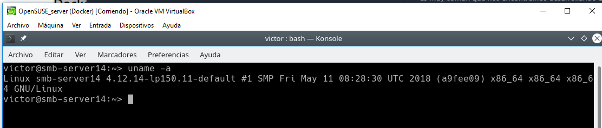
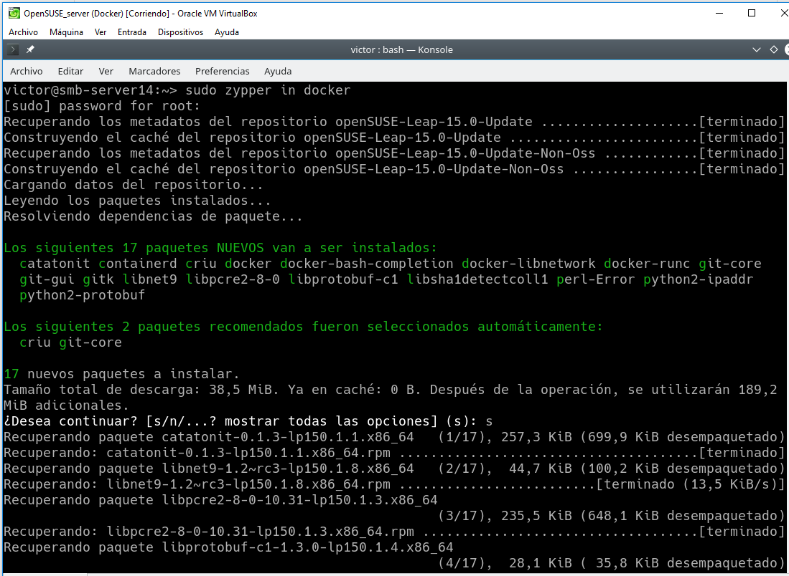
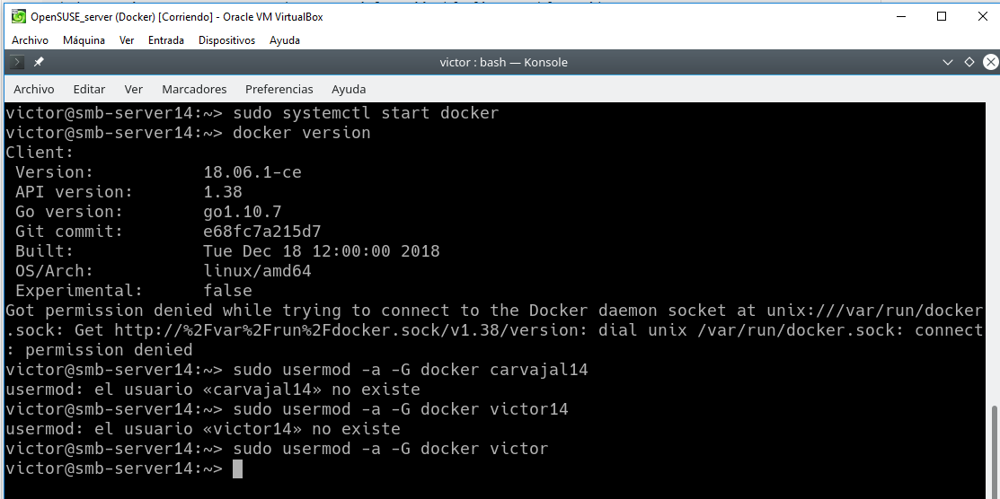
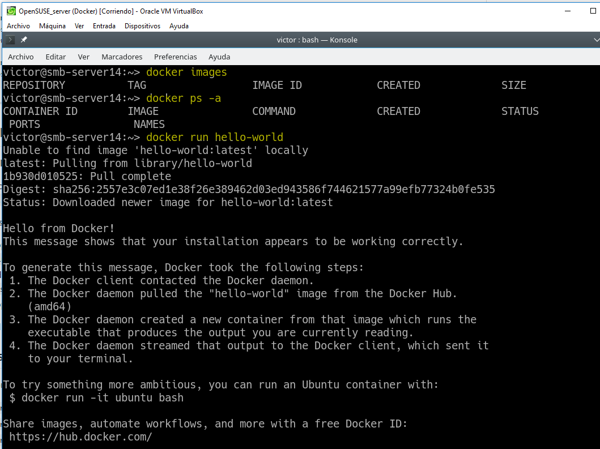
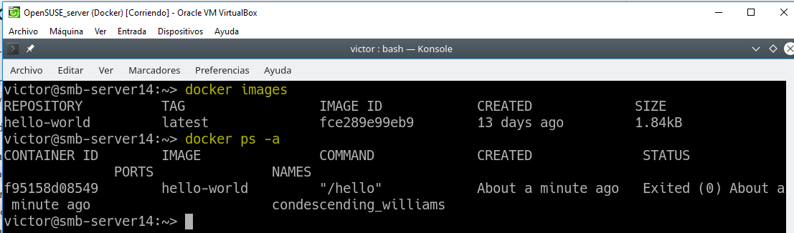
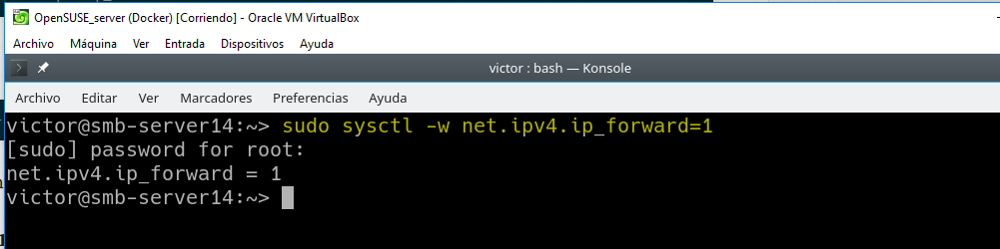

# 1. Introducción.

Es muy común que nos encontremos desarrollando una aplicación y llegue el momento que decidamos tomar todos sus archivos y migrarlos ya sea al ambiente de producción, de prueba o simplemente probar su comportamiento en diferentes plataformas y servicios. Para situaciones de este estilo existen herramientas que, entre otras cosas, nos facilitan el embalaje y despliegue de la aplicación, es aquí donde entra en juego Docker.
Esta herramienta nos permite crear lo que ellos denominan contenedores, lo cual son aplicaciones empaquetadas auto-suficientes, muy livianas que son capaces de funcionar en prácticamente cualquier ambiente, ya que tiene su propio sistema de archivos, librerías, terminal, etc.

**Docker es una tecnología contenedor de aplicaciones construida sobre LXC.**

# 2. Requisitos.

Vamos a usar MV OpenSUSE. Nos aseguraremos que tiene una versión del Kernel 3.10 o superior (`uname -a`).

# 3. Instalación y primeras pruebas.

> El último paso es añadir permisos a nuestro usuario.

Cerrar sesión y entrar con nuestro usuario.

# 4. Configuración de la red.

Si queremos que nuestro contenedor tenga acceso a la red exterior, debemos activar la opción IP_FORWARD (`net.ipv4.ip_forward`). Lo podemos hacer en YAST.

## 4.1 Más comandos.

Información sobre otros comandos útiles:

docker stop CONTAINERID, parar un contenedor que estaba iniciado.

docker start CONTAINERID, inicia un contenedor que estaba parado.

docker attach CONTAINERID, conecta el terminal actual con el interior de contenedor.

docker ps, muestra los contenedores en ejecución.

docker ps -a, muestra todos los contenedores en ejecución o no.

docker rm CONTAINERID, eliminar un contenedor.

docker rmi IMAGENAME, eliminar una imagen.
