# 1. Introducción.

Es muy común que nos encontremos desarrollando una aplicación y llegue el momento que decidamos tomar todos sus archivos y migrarlos ya sea al ambiente de producción, de prueba o simplemente probar su comportamiento en diferentes plataformas y servicios. Para situaciones de este estilo existen herramientas que, entre otras cosas, nos facilitan el embalaje y despliegue de la aplicación, es aquí donde entra en juego Docker.
Esta herramienta nos permite crear lo que ellos denominan contenedores, lo cual son aplicaciones empaquetadas auto-suficientes, muy livianas que son capaces de funcionar en prácticamente cualquier ambiente, ya que tiene su propio sistema de archivos, librerías, terminal, etc.

**Docker es una tecnología contenedor de aplicaciones construida sobre LXC.**

# 2. Requisitos.

Vamos a usar MV OpenSUSE. Nos aseguraremos que tiene una versión del Kernel 3.10 o superior (`uname -a`).

# 3. Instalación y primeras pruebas.

> El último paso es añadir permisos a nuestro usuario.

Cerrar sesión y entrar con nuestro usuario.

# 4. Configuración de la red.

Si queremos que nuestro contenedor tenga acceso a la red exterior, debemos activar la opción IP_FORWARD (`net.ipv4.ip_forward`). Lo podemos hacer en YAST.

## 4.1 Más comandos.

Información sobre otros comandos útiles:

`docker stop CONTAINERID`, parar un contenedor que estaba iniciado.

`docker start CONTAINERID`, inicia un contenedor que estaba parado.

`docker attach CONTAINERID`, conecta el terminal actual con el interior de contenedor.

`docker ps`, muestra los contenedores en ejecución.

`docker ps -a`, muestra todos los contenedores en ejecución o no.

`docker rm CONTAINERID`, eliminar un contenedor.

`docker rmi IMAGENAME`, eliminar una imagen.

# 5. Creación manual.

Nuestro SO base es OpenSUSE, pero vamos a crear un contenedor Debian8, y dentro instalaremos Nginx.

# 5.1 Crear una imagen manualmente.

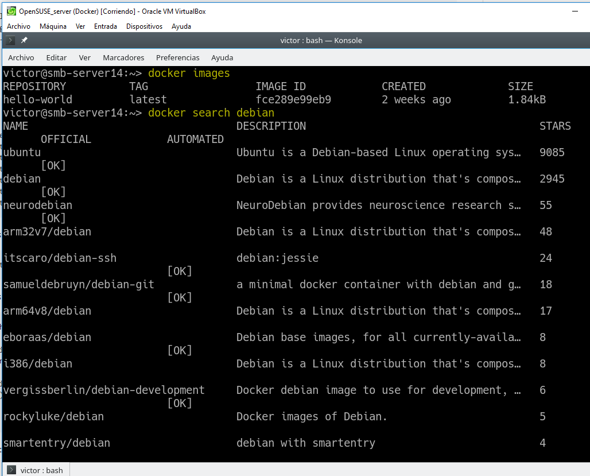

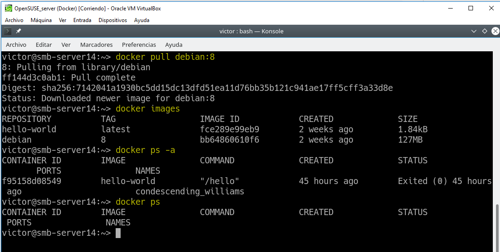

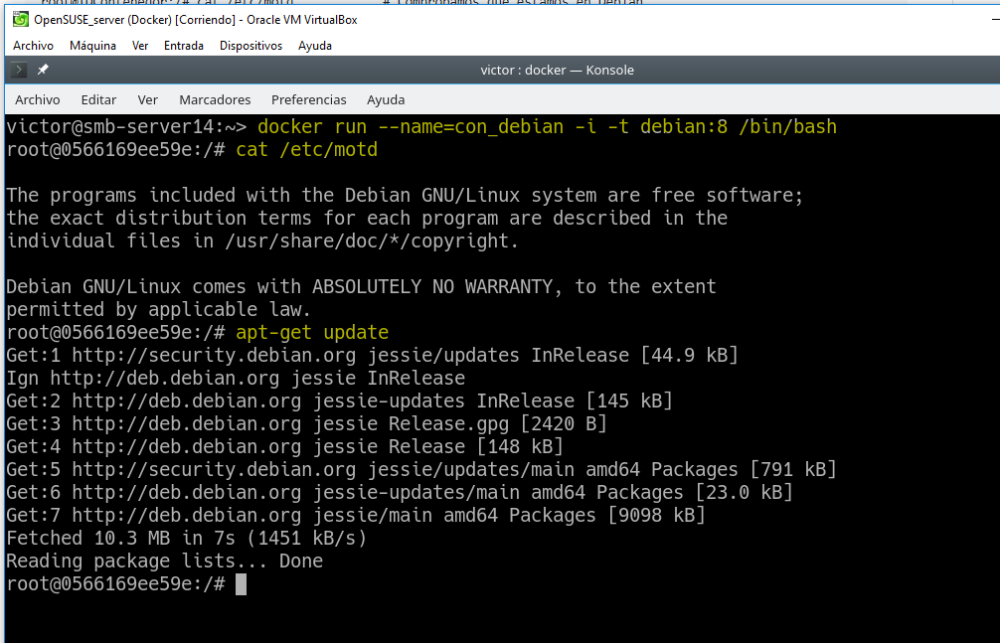

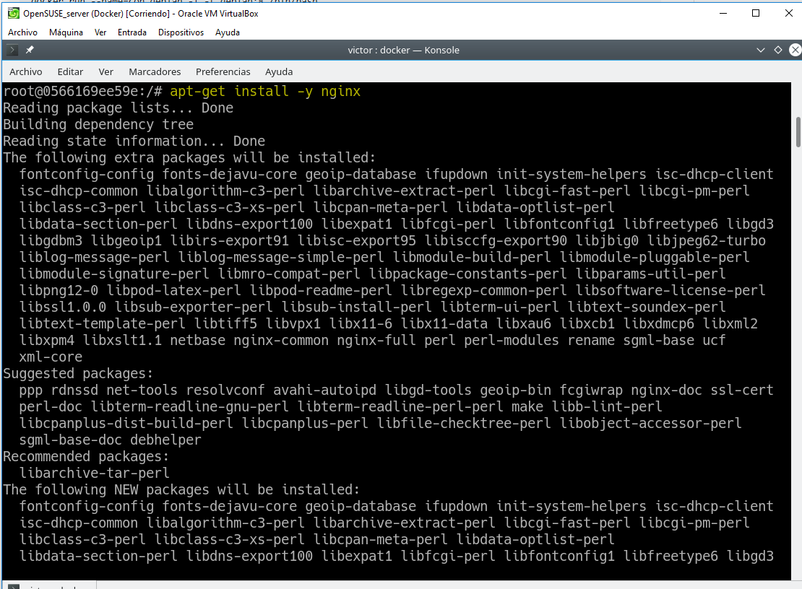

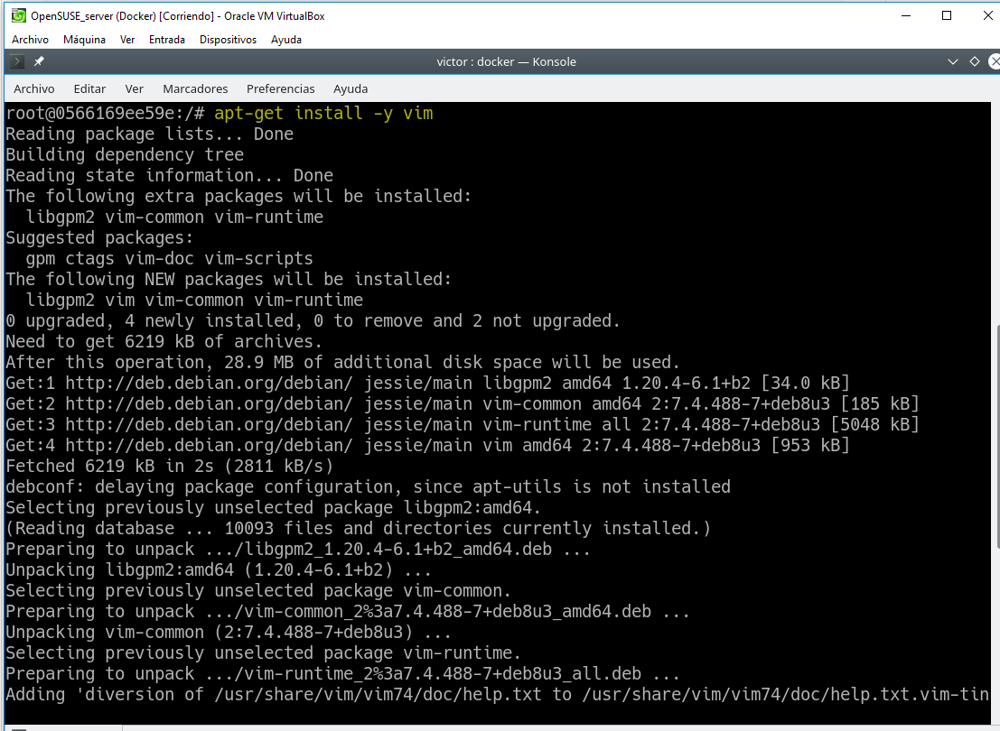

Iniciamos el servicio.

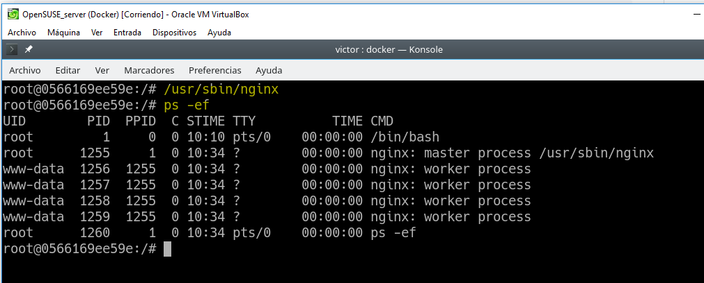

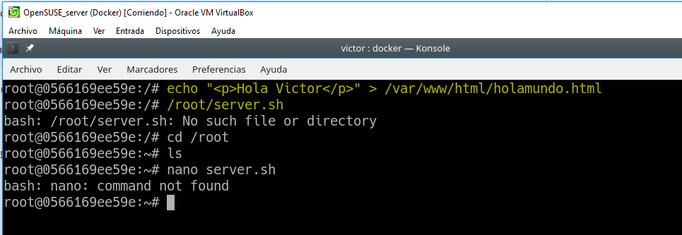

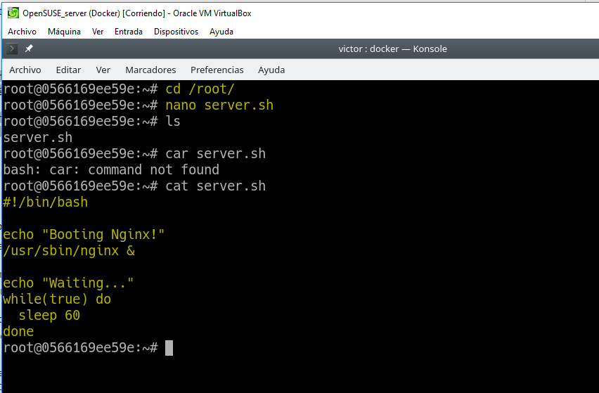

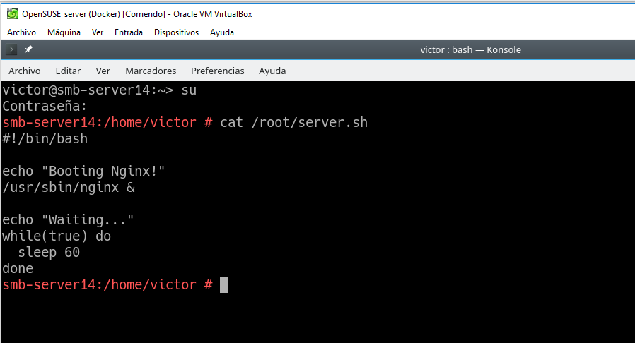

> Esta imagen muestra que debemos tener en la ruta /root un archivo server.sh con lo siguiente.

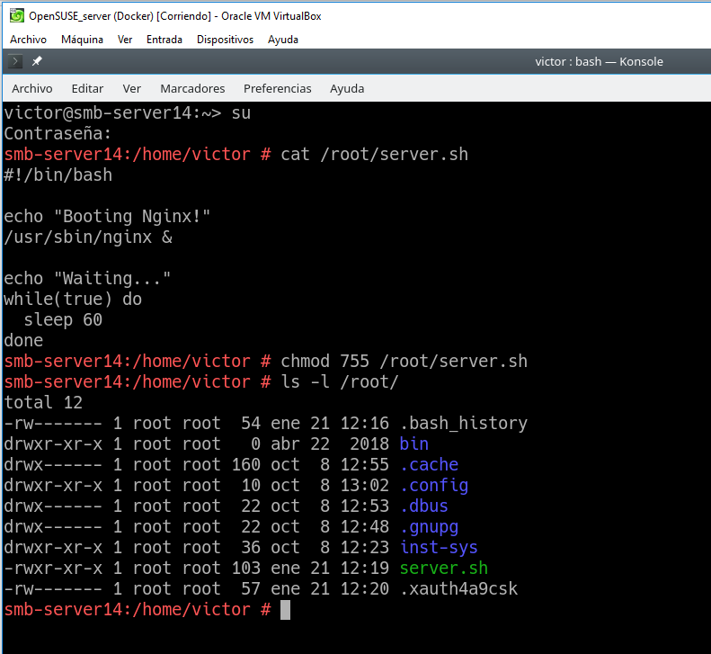

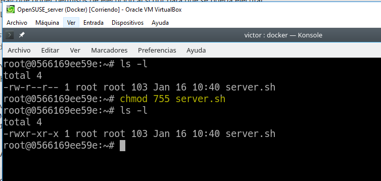

Ya tenemos nuestro contenedor auto-suficiente de Nginx, ahora debemos crear una nueva imagen con los cambios que hemos hecho, para esto abrimos otra ventana de terminal y busquemos el IDContenedor.

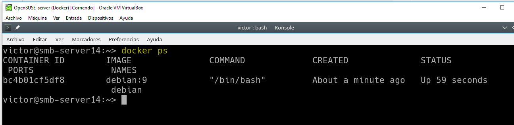

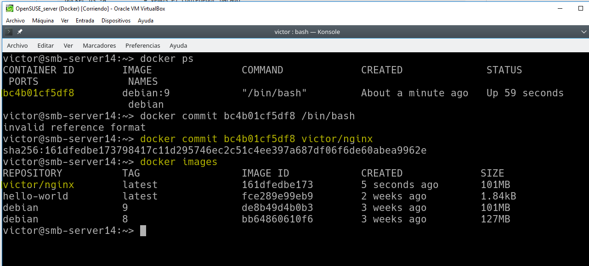

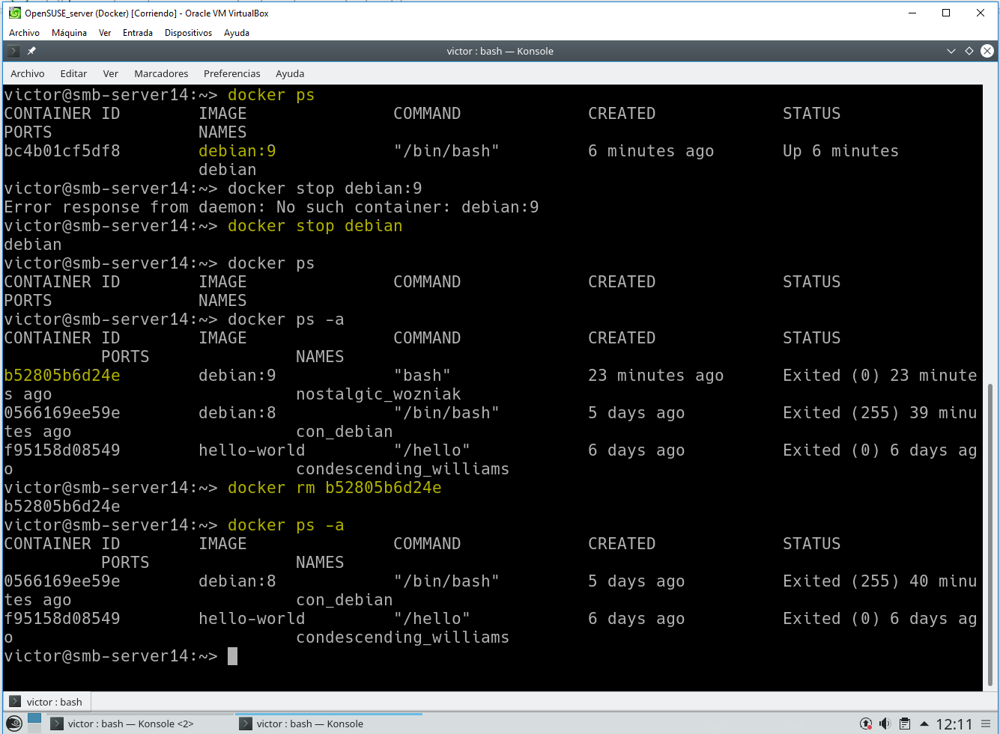

# 5.2 Crear contenedor con Nginx.

Iniciemos el contenedor de la siguiente manera:

`docker ps`

`docker ps -a`

`docker run --name=con_nginx -p 80 -t dvarrui/nginx /root/server.sh`

Booting Nginx!

Waiting...

Los mensajes muestran que el script server.sh está en ejecución. No parar el programa. Es correcto.

El argumento -p 80 le indica a Docker que debe mapear el puerto especificado del contenedor, en nuestro caso el puerto 80 es el puerto por defecto sobre el cual se levanta Nginx.

El script server.shnos sirve para iniciar el servicio y permanecer en espera. Lo podemos hacer también con el prgorama Supervisor.

Abrimos una nueva terminal.

`docker ps`, nos muestra los contenedores en ejecución. Podemos apreciar que la última columna nos indica que el puerto 80 del contenedor está redireccionado a un puerto local 0.0.0.0.:NNNNNN->80/tcp.

Abrir navegador web y poner URL 0.0.0.0.:NNNNNN. De esta forma nos conectaremos con el servidor Nginx que se está ejecutando dentro del contenedor.

Comprobar el acceso a holamundo.html.

Paramos el contenedor y lo eliminamos.

`docker ps`

`docker stop con_nginx`

`docker ps`

`docker ps -a`

`docker rm con_nginx`

`docker ps -a`

Como ya tenemos una imagen docker, podemos crear nuevos contenedores cuando lo necesitemos.

# 6. Crear un contenedor con Dockerfile.

Ahora vamos a conseguir el mismo resultado del apartado anterior, pero usando un fichero de configuración, llamado Dockerfile.

## 6.1 Comprobaciones iniciales:

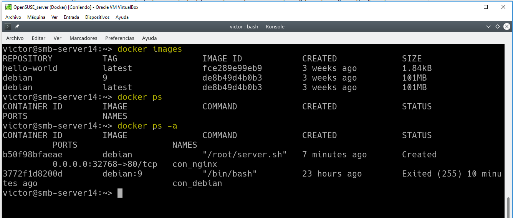

## 6.2 Preparar ficheros.

Crear directorio `/home/nombre-alumno/dockerXX`, poner dentro los siguientes ficheros:

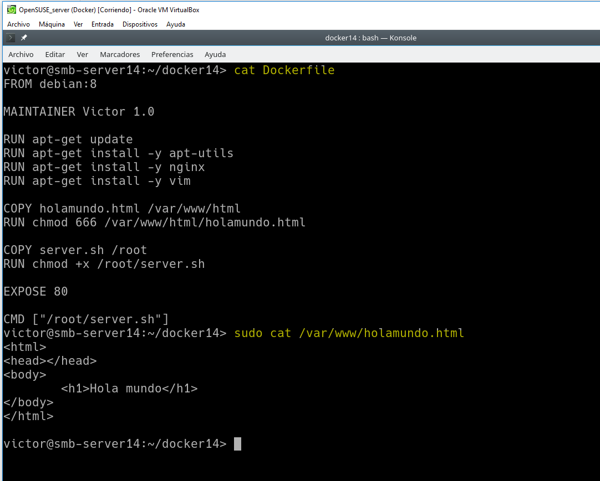

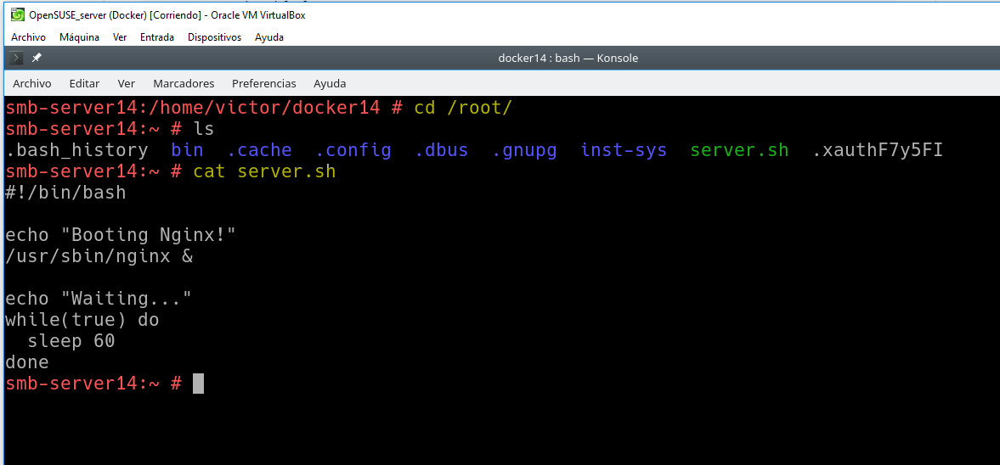

## 6.3 Crear imagen desde el Dockerfile.

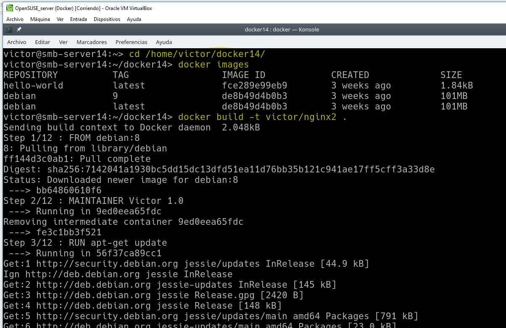
