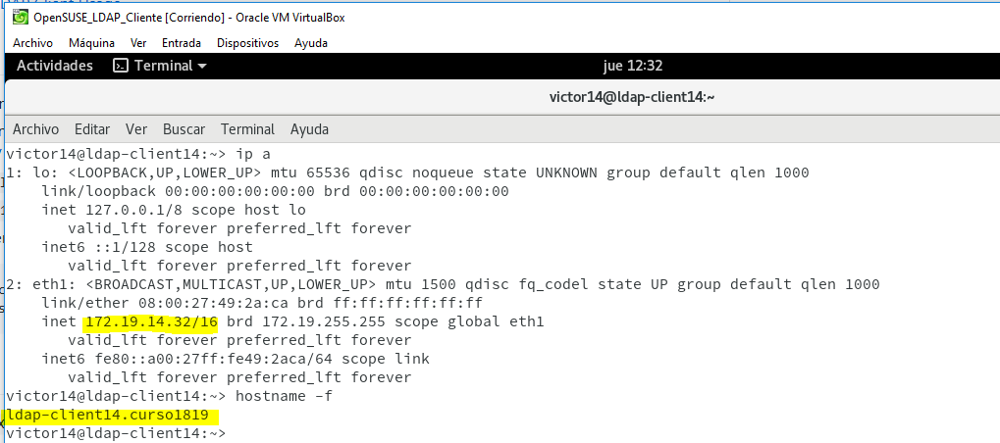
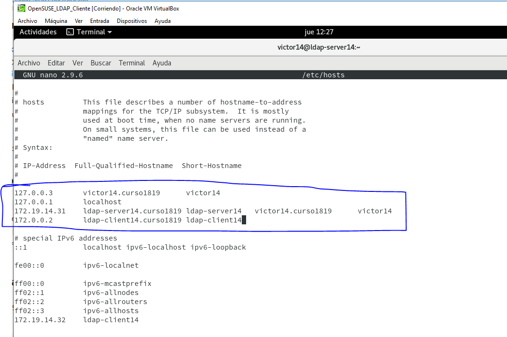
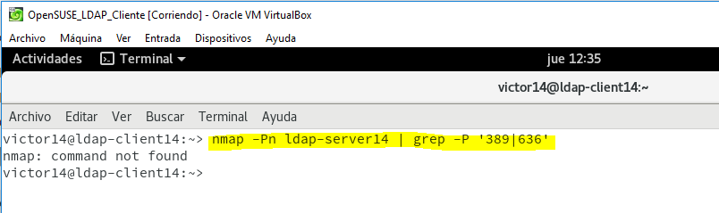
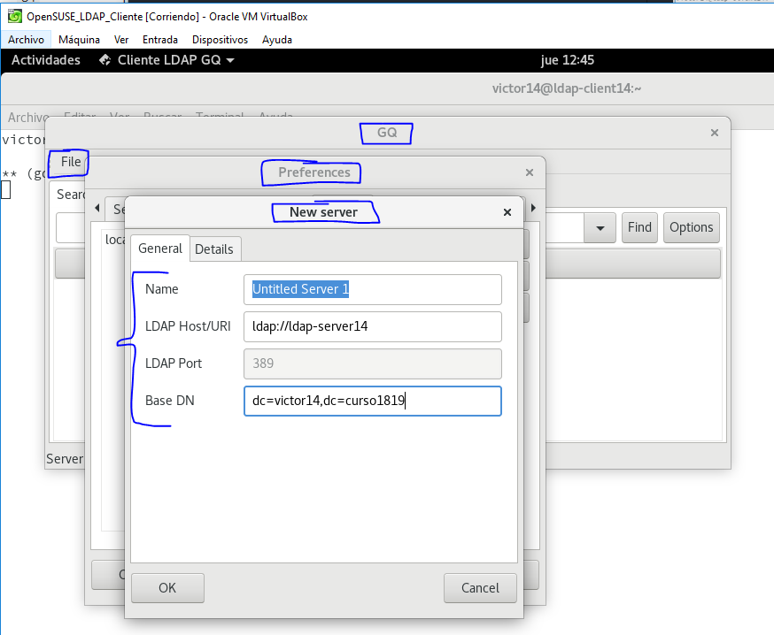

# 1. Prerrequisitos.

En esta guía vamos a instalar y configurar del servidor LDAP con OpenLDAP.

## 1.1 Nombre del equipo FQDN.

## 1.2 Opening the Required Ports in the Firewall.

Comprobamos el estado del antivirus.

## 1.5 About the `setup-ds-admin.pl` Script.

Las instancias del directorio servidor y el servidor de administración son creadas y configuradas a partir de un script llamado setup-ds-admin.pl. El directorio servidor solo puede ser creado usando el setup-ds.pl script.

Si, simplemente, el script de configuración está operativo, entonces el script lanza un interactivo instalador que guía por herramientas de configuración en el directorio servidor y las instancias del servidor de administración. Por ejemplo:

# 2. Instalar el servidor.

## 2.1 Información.

## Directory Server User and Group.

Parece que lo va a crear automáticamente...(dirsrv).

## Directory Suffix.

El Directory Suffix es la tercera entrada dentro del árbol de directorios. Al menos un directorio sufijo debe ser proveído cuando el directorio servidor está configurado. El directorio sufijo recomendado empareja sus nombres con tu organización de dominios de nombre DNS. Por ejemplo, si el hostname del directorio servidor is `ldap.example.com`, el directorio sufijo es `dc=example,dc=com`.

## 2.2 About the `setup-ds-admin.pl` Script.

Las instancias del servidor de directorios y del servidor de administración se crean y configuran mediante una secuencia de comandos denominada Setup-DS-admin.pl. El servidor de directorios solo se puede crear mediante el script Setup-DS.pl.
Si simplemente se ejecuta la secuencia de comandos de configuración, el script inicia un instalador interactivo que solicita la configuración de las instancias del servidor de directorios y del servidor de administración. Por ejemplo:

> No vamos a encontrar ese script.

Buscamos en los paquetes del SO.

Lo instalamos.

> El script tiene otro nombre.

El script se encuentra aquí.

Comprobamos si el demonio está operativo.

> Para comprobar que el servidor LDAP es accesible desde la red.

# 3. Browser LDAP.

## 3.1 Comprobar.

Podemos comprobar el contenido de la base de datos LDAP usando la herramienta `gq`. Esta herramienta es un browser LDAP.

---------------PARA REVISAR---------------------

Necesitaremos ajustar parámetros del kernel para asegurarnos de que la instalación no se quejará por la falta de recursos. Vamos a crear el siguiente fichero con la siguiente información:

Ejecutamos los cambios.

# 2. Instalar el servidor de directorio 389.

Necesitamos añadir los repositorios con los ficheros del proyecto LDAP.

Instalar los siguientes paquetes.

# 3. Ajustamos la configuración.

Solucionamos problemas con las dependencias de los paquetes.

Ahora tenemos que editar y localizar las siguientes líneas.

Deberíamos ser capaces de ejecutar este comando sin problemas.

# 4. Después de la instalación: arreglando 389-console.

Procedemos a la instalación del módulo Yast que sirve para gestionar el servidor LDAP `yast2-auth-server`. Para ello:

Hay una duda ya que no aparece el `Authentication Server` así que iremos a la siguiente pantalla para poder configurar de alguna manera el LDAP.

Comprobaciones después de la configuración.

## 1.3 Problemas.

Este espacio está destinado a problemas diversos con el LDAP por si tenemos que desinstalar el software anterior. Seguir estos pasos:

`zypper remove yast2-auth-server`

`zypper remove openldap2 krb5-server krb5-client`

`mv /etc/openldap /etc/openldap.000`

`mv /var/lib/ldap /var/lib/ldap.000`

## 1.4 Crear usuarios y grupos LDAP.

Crear grupo y usuarios.

Hecho esto, debemos  usar un comando para consultar en la base de datos LDAP la información del usuario con uid concreto.

# 2. Cliente LDAP.

## 2.1 Preparativos.

## Comprobación.

Comprobar que el servidor LDAP es accesible desde el cliente.

Comprobamos que siguen existiendo los usuarios y grupos creados.

