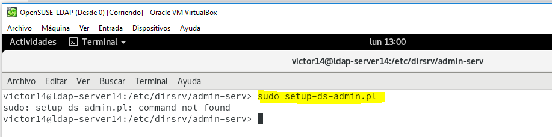
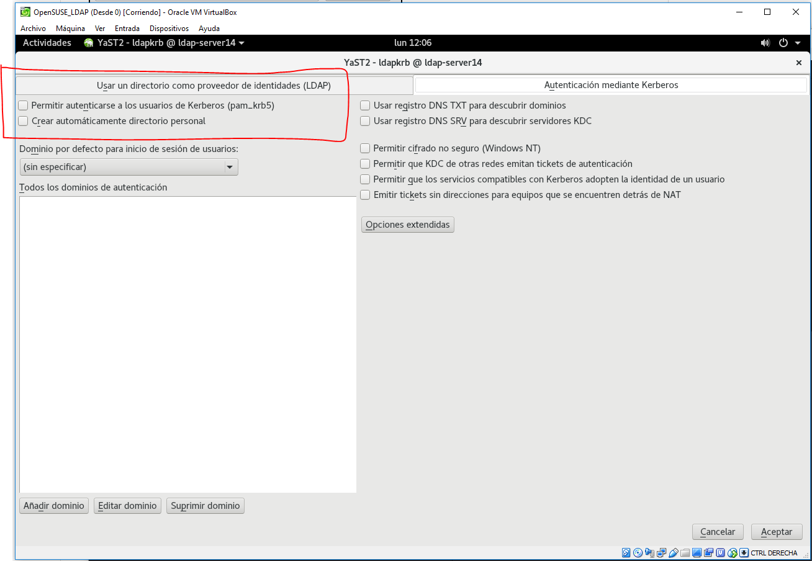

# Servidor 389-DS - OpenSUSE.

# 1. Prerrequisitos.

En esta guía vamos a instalar y configurar del servidor LDAP con OpenLDAP.

Necesitaremos ajustar parámetros del kernel para asegurarnos de que la instalación no se quejará por la falta de recursos. Vamos a crear el siguiente fichero con la siguiente información:

Ejecutamos los cambios.

# 2. Instalar el servidor de directorio 389.

Necesitamos añadir los repositorios con los ficheros del proyecto LDAP.

Instalar los siguientes paquetes.

# 3. Ajustamos la configuración.

Solucionamos problemas con las dependencias de los paquetes.

Ahora tenemos que editar y localizar las siguientes líneas.

Deberíamos ser capaces de ejecutar este comando sin problemas.

# 4. Después de la instalación: arreglando 389-console.

Procedemos a la instalación del módulo Yast que sirve para gestionar el servidor LDAP `yast2-auth-server`. Para ello:

Hay una duda ya que no aparece el `Authentication Server` así que iremos a la siguiente pantalla para poder configurar de alguna manera el LDAP.

Comprobaciones después de la configuración.

## 1.3 Problemas.

Este espacio está destinado a problemas diversos con el LDAP por si tenemos que desinstalar el software anterior. Seguir estos pasos:

`zypper remove yast2-auth-server`

`zypper remove openldap2 krb5-server krb5-client`

`mv /etc/openldap /etc/openldap.000`

`mv /var/lib/ldap /var/lib/ldap.000`

## 1.4 Crear usuarios y grupos LDAP.

Crear grupo y usuarios.

Hecho esto, debemos  usar un comando para consultar en la base de datos LDAP la información del usuario con uid concreto.

