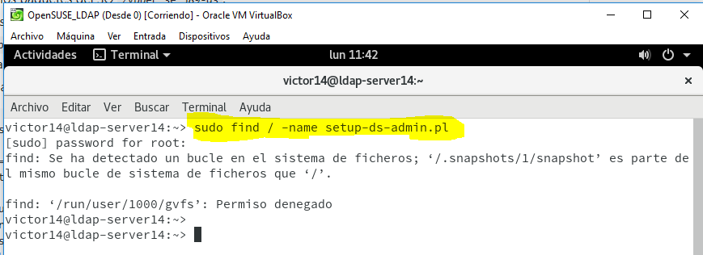
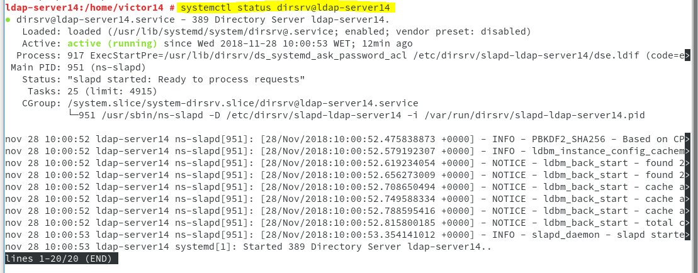

# 1. Prerrequisitos.

En esta guía vamos a instalar y configurar del servidor LDAP con OpenLDAP.

## 1.1 Nombre del equipo FQDN.

## 1.2 Opening the Required Ports in the Firewall.

Comprobamos el estado del antivirus.

## 1.5 About the `setup-ds-admin.pl` Script.

Las instancias del directorio servidor y el servidor de administración son creadas y configuradas a partir de un script llamado setup-ds-admin.pl. El directorio servidor solo puede ser creado usando el setup-ds.pl script.

Si, simplemente, el script de configuración está operativo, entonces el script lanza un interactivo instalador que guía por herramientas de configuración en el directorio servidor y las instancias del servidor de administración. Por ejemplo:

# 2. Instalar el servidor.

## 2.1 Información.

## Directory Server User and Group.

Parece que lo va a crear automáticamente...(dirsrv).

## Directory Suffix.

El Directory Suffix es la tercera entrada dentro del árbol de directorios. Al menos un directorio sufijo debe ser proveído cuando el directorio servidor está configurado. El directorio sufijo recomendado empareja sus nombres con tu organización de dominios de nombre DNS. Por ejemplo, si el hostname del directorio servidor is `ldap.example.com`, el directorio sufijo es `dc=example,dc=com`.

## 2.2 About the `setup-ds-admin.pl` Script.

Las instancias del servidor de directorios y del servidor de administración se crean y configuran mediante una secuencia de comandos denominada Setup-DS-admin.pl. El servidor de directorios solo se puede crear mediante el script Setup-DS.pl.
Si simplemente se ejecuta la secuencia de comandos de configuración, el script inicia un instalador interactivo que solicita la configuración de las instancias del servidor de directorios y del servidor de administración. Por ejemplo:

> No vamos a encontrar ese script.

Buscamos en los paquetes del SO.

Lo instalamos.

> El script tiene otro nombre.

El script se encuentra aquí.

Comprobamos si el demonio está operativo.

> Para comprobar que el servidor LDAP es accesible desde la red.

## 2.3 Comprobación del servicio.

> Primero comprobamos si el servicio está en ejecución. Luego, comprobamos si el demonio está en ejecución y, por último, comprobamos que el servidor LDAP es accesible desde la red.

# 3. Browser LDAP.

## 3.1 Instalar browser LDAP.

Creamos una nueva conexión con las credenciales de nuestro ordenador OpenSUSE ya que OpenLDAP es una herramienta propia de Windows y nos conectaremos en remoto.

> No aparecen ni grupos ni usuarios así que deberíamos crearlos.

## 3.2 Crear usuarios y grupos dentro del LDAP.

En este punto vamos a escribir información dentro del servidor de directorios LDAP.

Vamos a GQ y funciona.

> En el momento en que intentamos crear los usuarios y grupos nos parece el siguiente texto después de que pulsemos donde vamos a crear los usuarios.
