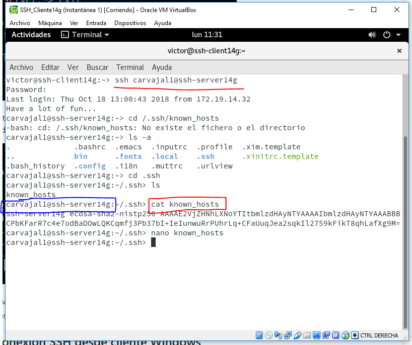
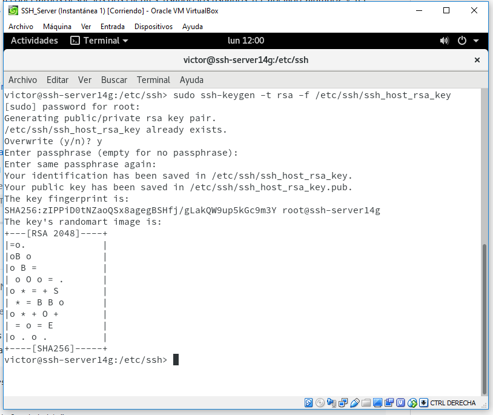
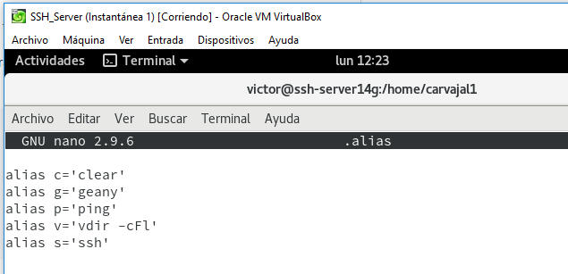
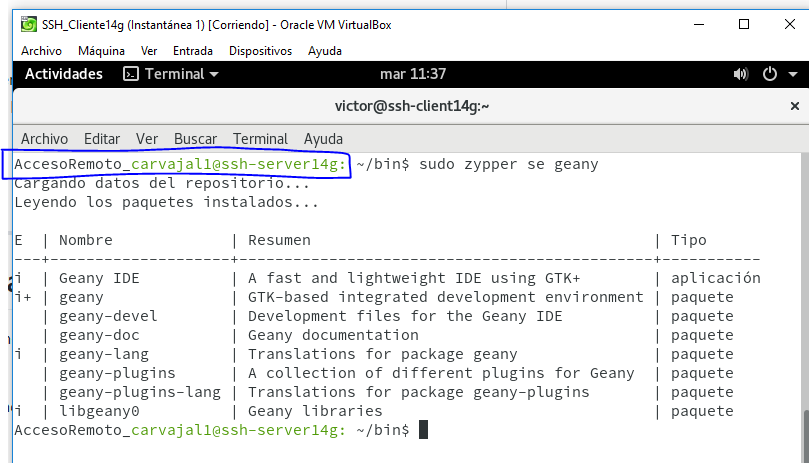

# Acceso remoto SSH.

# 1. Preparativos.

## 1.1 Servidor SSH.

Configuramos la MV de OpenSUSE que funcionará como servidor.

Vamos a hacer los mismo con una máquina virtual más que será el cliente.

Añadimos en **/etc/hosts** los equipos **ssh-clientXXg** y **ssh-clientXXw**.

Comprobamos los cambios.

Creamos los siguientes usuarios en el servidor.

> Yast2 -> Gestión de usuarios y grupos.

## 1.2 Cliente GNU/Linux

Configuramos el cliente de la siguiente manera,

Añadimos en **/etc/hosts** el equipo **ssh-serverXXg** y **ssh-clientXXw**.

Comprobamos que existe ping entre ambos equipos.

## 1.3 Cliente Windows.

Configuramos la IP del cliente Windows.

Cambiamos el nombre del equipo.

Añadimos las direcciones de las demás máquinas.

Probamos a hacer ping para observar si se conectan entre ellas.

# 2. Instalación del servicio SSH.

## 2.1 Comprobación.

Observamos los puertos a los que se conecta el ssh.

## 2.2 Primera conexión SSH desde cliente GNU/Linux.

Comprobamos la conectividad con el servidor desde el cliente.

Desde el cliente comprobamos que el servicio SSH es visible con el servidor. Debe mostrarnos que el puerto 22 está abierto.

Vamos a comprobar el funcionamiento de la conexión SSH desde cada cliente usando el usuario 1er-apellido-alumno1.
Desde el cliente GNU/Linux nos conectamos mediante ssh 1er-apellido-alumno1@ssh-serverXXg. Tendrá lugar una creación de contraseñas que habrá que mostrar con cada usuario.

Ahora debemos comprobar  el contenido del fichero **$HOME/.ssh/known_hosts** en el equipo **ssh-client1**.

> Podemos observar que existe una clave de acceso que es la clave de identificación de ssh-server.

## 2.3 Primera conexión SSH desde cliente Windows.

 Desde el cliente de Windows nos vamos a conectar usando **Putty** al servidor.

> Hacemos lo mismo que en el punto anterior que es registrar las claves de acceso al servidor desde el cliente. Vemos que podemos conectarnos por SSH perfectamente.

# 3. ¿Y si cambiamos las claves del servidor?

Tenemos que confirmar que existen los siguientes ficheros en **/etc/ssh**. Los ficheros **ssh_host*key** y **ssh_host*key.pub** son ficheros de claves públicas y privadas que necesitamos para establecer conexión entre máquinas.

Vamos a modificar el fichero de configuración SSH **/etc/ssh/sshd_config** para dejar una única línea **HostKey /etc/ssh/ssh_host_rsa_key**. El resto de líneas las tenemos que comentar  para que solo se permita acceder con la configuración insertada antes.

## Regenerar certificados.

En **ssh-serverXXg** como usuario root ejecutamos **ssh-keygen -t rsa -f /etc/ssh/ssh_host_rsa_key**.

> No poner password al certificado de la máquina.

Reiniciar el servicio SSH usando **systemctl restart sshd**.

> Comprobar que el servicio está en ejecución correctamente con **systemctl status sshd**.

## Comprobamos.

> Podemos observar que salta un aviso de que no se ha podido ingresar desde el cliente de OpenSUSE debido a los cambios hechos anteriormente.

# 4. Personalización del prompt bash.

Vamos a cambiar el prompt de **carvajal1**. Accedemos a **/home/carvajal1/.bashrc**

Además, crearemos otro fichero en la misma ruta con este contenido.

Comprobamos la conexión.

> Hay que volver a entrar en el servidor y volver a comentar la línea de rsa en **/etc/ssh/sshd_config** debido a que no podremos conectar con el servidor sin cambiarlo.

# 5. Autenticación mediante claves públicas.

El objetivo de este apartado es el de configurar SSH para poder acceder desde el cliente1, usando el nombre-alumno sin poner password, pero usando claves pública/privada. Vamos a entrar en el cliente y generamos nuevas claves.

Ahora debemos copiar las claves desde el cliente hasta el otro cliente en remoto usando el siguiente comando.

Vamos a ver que ahora, desde el cliente4, podemos acceder sin necesidad de poner contraseña.

# 6. Uso de SSH como túnel para X.

Vamos a instalar una app en el servidor y hacer posible que los clientes, por remoto, puedan ejecutarla.

Vamos al servidor y en la configuración dejamos la siguiente línea así.

Vamos al cliente y nos aseguramos de que no tenemos instalada la aplicación del servidor. Una vez hecho esto, nos conectamos en remoto...

 y observamos que, desde el cliente, podemos observar las aplicaciones instaladas en el servidor.

# 7. Aplicaciones Windows nativas.

Instalamos el emulador Wine en el ssh-serverXXg. Puede tardar un poco.

Wine es una utilidad que permite ejecutar archivos propios de Windows en Linux. Ahora vamos a probar hacer justo esto.

> Se trata de un archivo .exe que se puede instalar en Windows pero, gracias a Wine, se puede abrir también en Linux.

> Igualmente en esta máquina virtual no podemos arrancar el juego.
