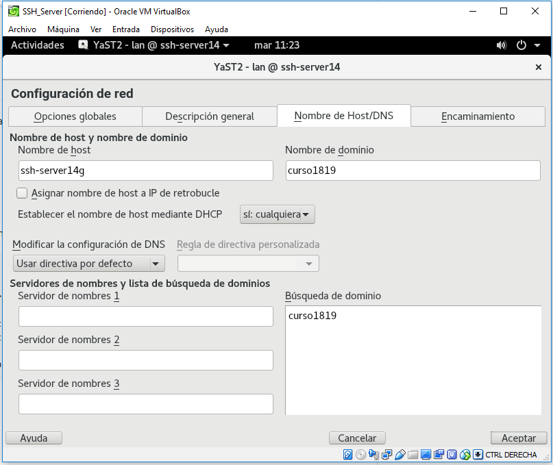

# Acceso remoto SSH.

# 1. Preparativos.

## 1.1 Servidor SSH.

Configuramos la MV de OpenSUSE que funcionará como servidor.

Vamos a hacer los mismo con una máquina virtual más que será el cliente.

Añadimos en **/etc/hosts** los equipos **ssh-clientXXg** y **ssh-clientXXw**.

Comprobamos los cambios.

