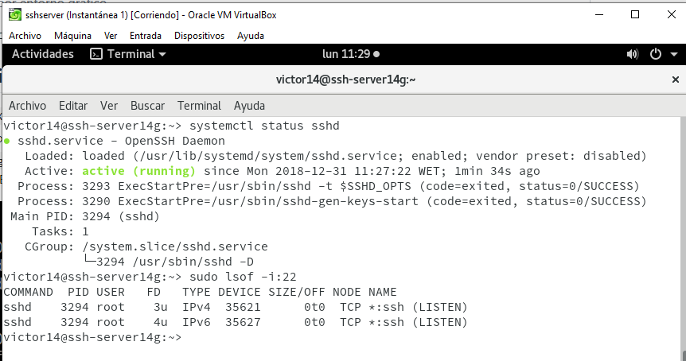
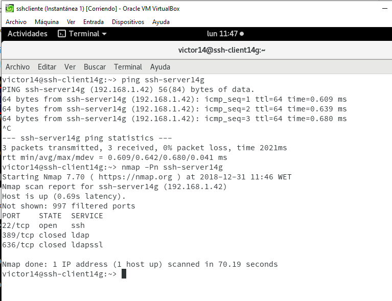
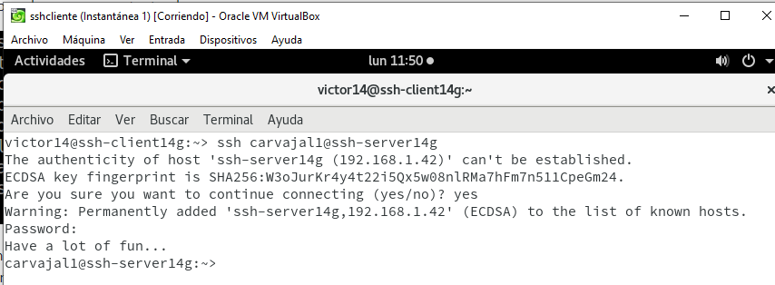
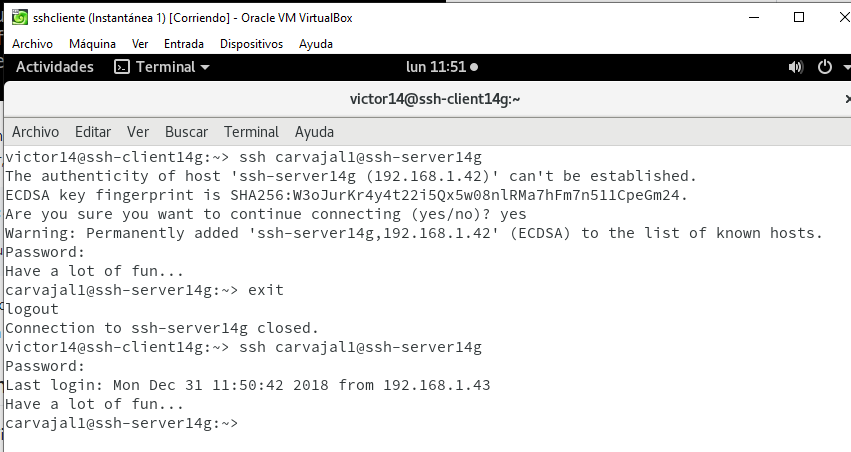
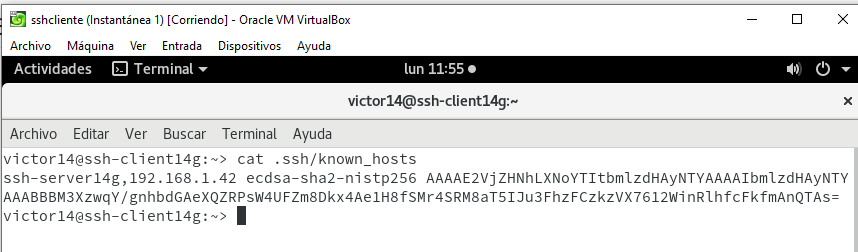
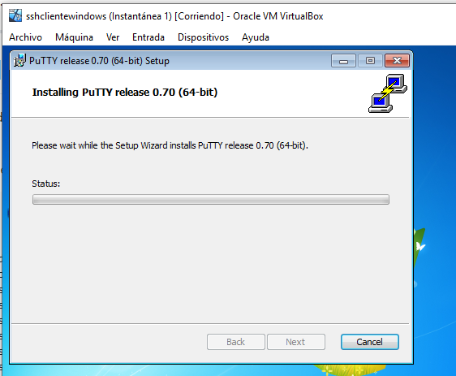
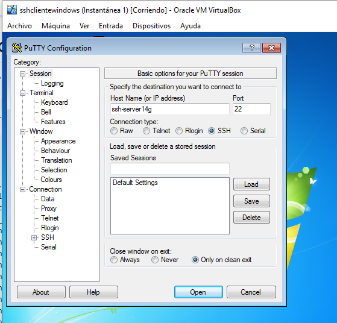
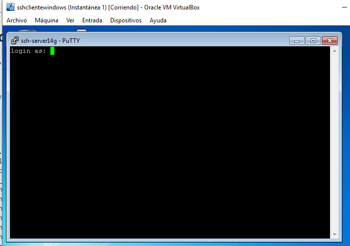

# Acceso remoto SSH.

# 1. Preparativos.

## 1.1 Servidor SSH.

Preparamos la máquina OpenSUSE servidor.

Creamos usuarios.

## 1.2 Cliente GNU/Linux.

## 1.3 Cliente Windows.

# 2. Instalación del servicio SSH.

Instalar SSH.

## 2.1 Comprobación.

## 2.2 Primera conexión SSH desde cliente GNU/Linux.

Desde el cliente.

Probamos conexión con los usuarios.

Salimos y volvemos a conectarnos.

Comprobamos el siguiente fichero para observar la clave que contiene.

## 2.3 Primera conexión SSH desde cliente Windows.

Nos conectamos desde Windows.

# 3. Cambiamos la identidad del servidor.
