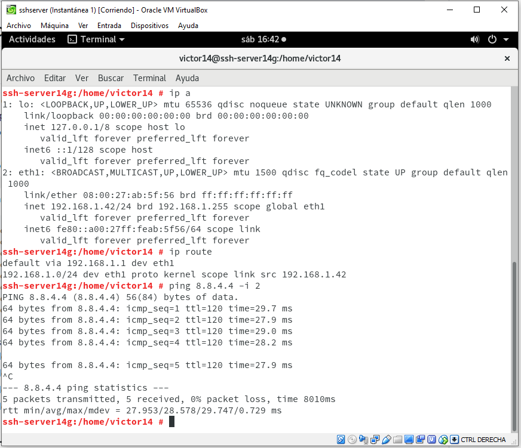
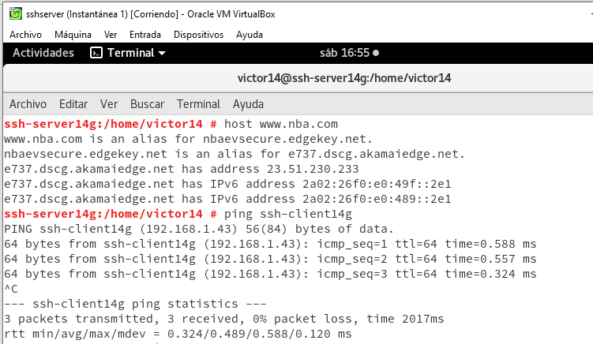
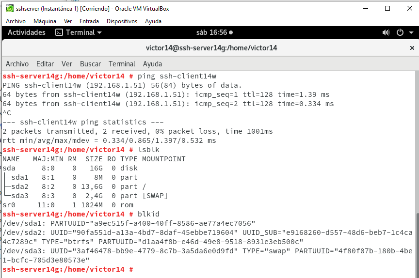
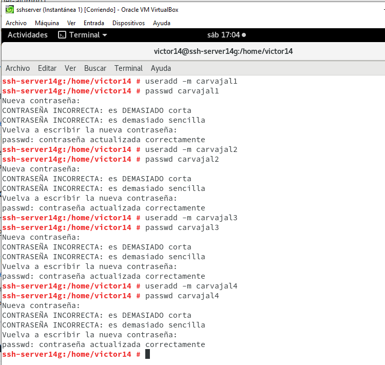
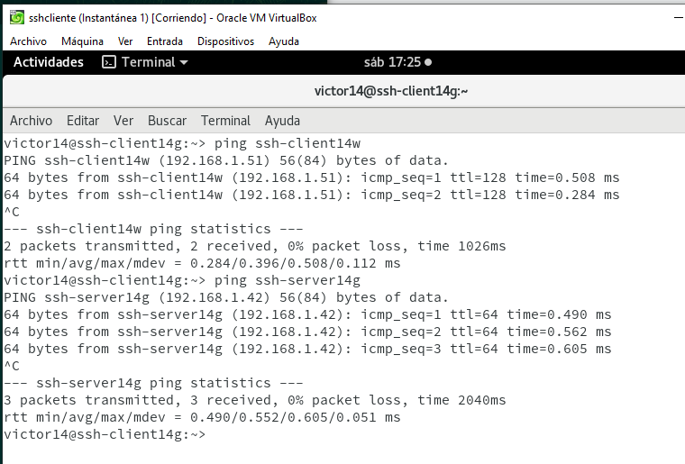
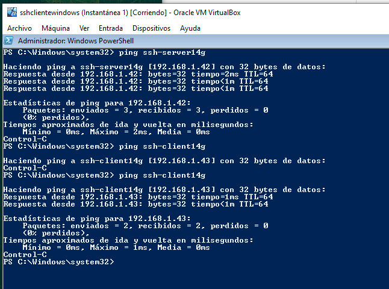

# Acceso remoto SSH.

# 1. Preparativos.

## 1.1 Servidor SSH.

Preparamos la máquina OpenSUSE servidor.

Creamos usuarios.

## 1.2 Cliente GNU/Linux.

## 1.3 Cliente Windows.

# 2. Instalación del servicio SSH.
