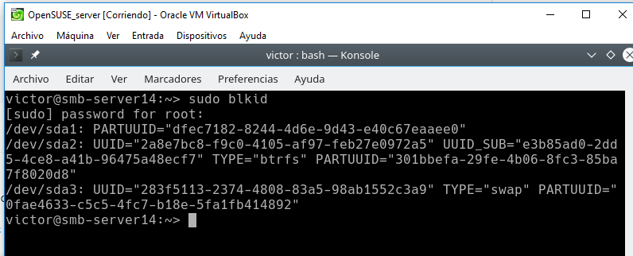

# Samba

Para esta práctica voy a usar **VNC**, **OpenSUSE_server** y **OpenSUSE_cliente**.

# 1. Servidor Samba.

## 1.1 Preparativos.

Configurar la máquina Samba servidor añadiendo también los hosts de las otras máquinas.

Comandos de comprobación.

## 1.2 Usuarios locales.

Creamos grupos.

Creamos el usuario `smbguest` y lo gestionamos para que no pueda usarlo nadie.

Creamos usuarios dentro de los grupos.

> El nombre cdrom no estaba disponible.
