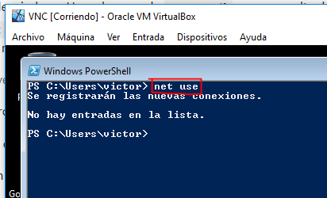

# Samba

Para esta práctica voy a usar **VNC**, **OpenSUSE_server** y **OpenSUSE_cliente**.

# 1. Servidor Samba.

## 1.1 Preparativos.

Configurar la máquina Samba servidor añadiendo también los hosts de las otras máquinas.

Comandos de comprobación.

## 1.2 Usuarios locales.

Creamos grupos.

Creamos el usuario `smbguest` y lo gestionamos para que no pueda usarlo nadie.

Creamos usuarios dentro de los grupos.

> El nombre cdrom no estaba disponible.

## 1.3 Crear las carpetas para los futuros recursos compartidos.

> Haciendo uso de los comandos `chown`, `chmod`, `chgrp` podemos cambiar el usuario propietario de la carpeta, sus permisos y el grupo propietario en ese orden.

## 1.4 Configurar el servidor Samba.

Vamos a hacer una copia de seguridad del fichero de configuración existente.

Vamos a Yast -> Servidor Samba.

## 1.5 Crear los recursos compartidos Samba.

Vamos a configurar los recursos compartido del servidor Samba. Vamos al terminal y vamos a `/etc/samba/smb.conf` e insertamos la siguiente información.

Y un último comando llamado `testparm`.

## 1.6 Usuarios Samba.

Después de crear los usuarios en el sistema, hay que añadirlos a Samba.

Comprobamos la lista de usuarios Samba.

## 1.7 Reiniciar.

Ahora que hemos terminado con el servidor, hay que reiniciar el servicio para que se lean los cambios de configuración.

Reiniciamos el servicio smb.

Reiniciamos el servicio nmb.

Verificamos la sintaxis del fichero de configuración del servidor Samba.

Observamos que el servicio SMB/CIF está a la escucha.

# 2. Windows.

Configuramos los hosts de Windows.

> C:/Windows/System32/drivers/etc/hosts

## 2.1 Cliente Windows GUI.

Desde un cliente Windows vamos a acceder a los recursos compartidos del servidor Samba.

Intentamos conectarnos como un usuario en uno de los grupos del servidor.

> Debemos tener algún problema con el cortafuegos por lo que no podemos entrar.

Observamos las conexiones desde el servidor.

Desde el cliente Windows.

## 2.2 Cliente Windows comandos.

 Consultamos todas las conexiones/recursos conectados.

> `net use * /d /y` para cerrar las conexiones SMB.

Vemos las máquinas accesibles por la red.

