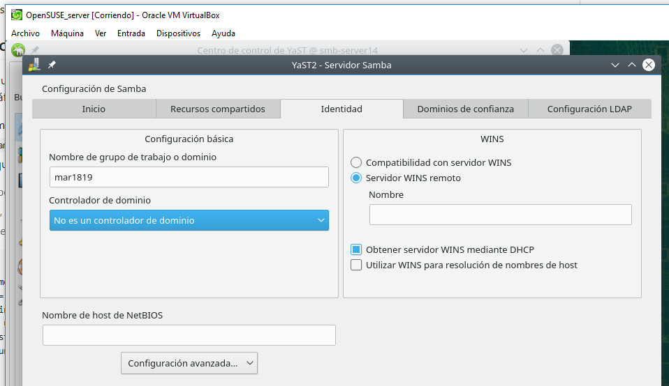
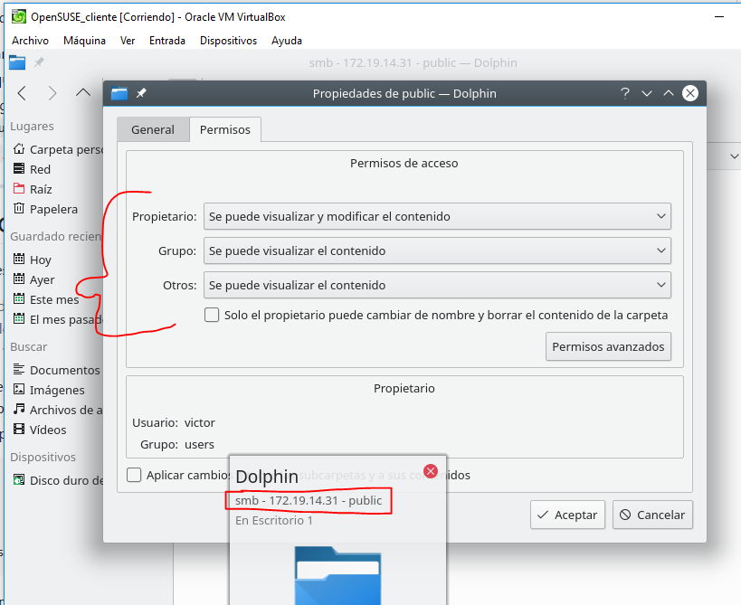
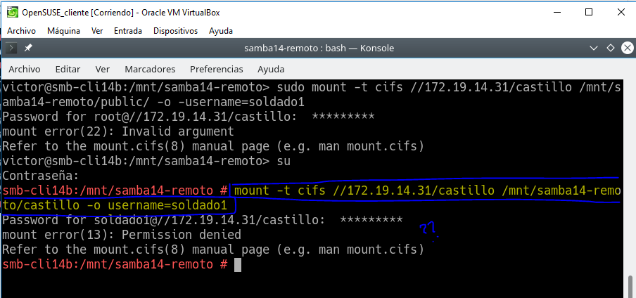
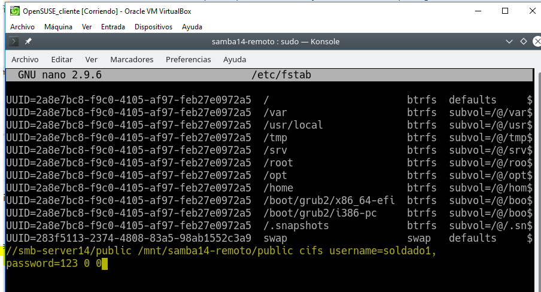

# Samba

Para esta práctica voy a usar **VNC**, **OpenSUSE_server** y **OpenSUSE_cliente**.

# 1. Servidor Samba.

## 1.1 Preparativos.

Configurar la máquina Samba servidor añadiendo también los hosts de las otras máquinas.

Comandos de comprobación.

## 1.2 Usuarios locales.

Creamos grupos.

Creamos el usuario `smbguest` y lo gestionamos para que no pueda usarlo nadie.

Creamos usuarios dentro de los grupos.

> El nombre cdrom no estaba disponible.

## 1.3 Crear las carpetas para los futuros recursos compartidos.

> Haciendo uso de los comandos `chown`, `chmod`, `chgrp` podemos cambiar el usuario propietario de la carpeta, sus permisos y el grupo propietario en ese orden.

## 1.4 Configurar el servidor Samba.

Vamos a hacer una copia de seguridad del fichero de configuración existente.

Vamos a Yast -> Servidor Samba.

## 1.5 Crear los recursos compartidos Samba.

Vamos a configurar los recursos compartido del servidor Samba. Vamos al terminal y vamos a `/etc/samba/smb.conf` e insertamos la siguiente información.

> Cuidado con copiar y pegar.

Y un último comando llamado `testparm`.

## 1.6 Usuarios Samba.

Después de crear los usuarios en el sistema, hay que añadirlos a Samba.

Comprobamos la lista de usuarios Samba.

## 1.7 Reiniciar.

Ahora que hemos terminado con el servidor, hay que reiniciar el servicio para que se lean los cambios de configuración.

Reiniciamos el servicio smb.

Reiniciamos el servicio nmb.

Verificamos la sintaxis del fichero de configuración del servidor Samba.

Observamos que el servicio SMB/CIF está a la escucha.

# 2. Windows.

Configuramos los hosts de Windows.

> C:/Windows/System32/drivers/etc/hosts

## 2.1 Cliente Windows GUI.

Desde un cliente Windows vamos a acceder a los recursos compartidos del servidor Samba.

Intentamos conectarnos como un usuario en uno de los grupos del servidor.

> Debemos tener algún problema con el cortafuegos por lo que no podemos entrar.

Observamos las conexiones desde el servidor.

Desde el cliente Windows.

## 2.2 Cliente Windows comandos.

 Consultamos todas las conexiones/recursos conectados.

> `net use * /d /y` para cerrar las conexiones SMB.

Vemos las máquinas accesibles por la red.

Abrimos una shell de Windows y usamos el comando `net use /?`, para consultar la ayuda del comando.

Ahora probamos conectarnos desde el cliente de Windows al servidor de Samba.

Comprobamos las conexiones.

Comprobamos los resultados.

# 3. Cliente GNU7Linux.

Configuramos el cliente OpenSUSE de Samba.

> /etc/hosts

## 3.1 Cliente GNU/Linux GUI.

Entramos a Yast y observamos que tenemos conexión al servidor de Samba.

Probamos a crear carpetas.

La carpeta `public` es solo de lectura.

Comprobaciones.

## 3.2 Cliente GNU/Linux comandos.

Primero comprobar el uso de las siguientes herramientas. El siguiente comando hay que observarlo desde Ubuntu, no desde OpenSUSE.

> El comando debería mostrar cierta información.

Ahora crearemos en local la carpeta.

Montamos la carpeta siguiente.

Comprobamos.

## 3.3 Montaje automático.

Para configurar acciones de montaje automáticos cada vez que se inicie el equipo, debemos configurar el fichero `/etc/fstab`.

Reiniciamos el equipo y comprobamos que se realizan los cambios.

# 4. Preguntas para resolver.

**¿Por qué tenemos dos servicios (smb y nmb) para Samba?**

Son dos servicios que son necesarios para que tanto Windows como OpenSUSE puedan compartir la información del samba.

**¿Las claves de los usuarios en GNU/Linux deben ser las mismas que las que usa Samba?**

No, deben ser distintas por seguridad.

**¿Puedo definir un usuario en Samba llamado soldado3, y que no exista como usuario del sistema?**

No, primero hay que definirlo en la máquina y luego implementarle la configuración de Samba.

**¿Cómo podemos hacer que los usuarios soldado1 y soldado2 no puedan acceder al sistema pero sí al samba? (Consultar /etc/passwd)**

**Añadir el recurso [homes] al fichero smb.conf según los apuntes. ¿Qué efecto tiene?**

Se crearía el recurso `homes` y, por consiguiente, la carpeta.

**¿Cómo pueden los clientes acceder al CDROM del servidor usando Samba?**

A través del `smbguest`, ya que es un usuario de ese grupo.

**/dev/cdrom ¿Dónde apunta? ¿Qué permisos tiene?**

**/dev/sr0 ¿Que permisos tiene?**

