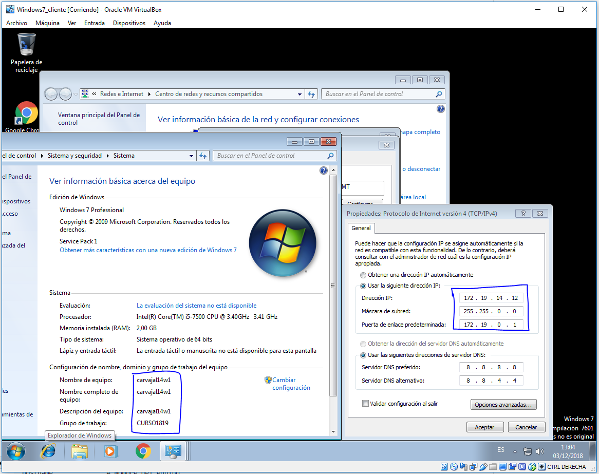

Víctor Gabriel Carvajal Aróstegui
Eleazar Sánchez Arbelo

# Servidor de Impresión en Windows.

Necesitaremos dos máquinas virtuales Windows como Windows7_cliente y Windows Server.

> Máquina cliente.
