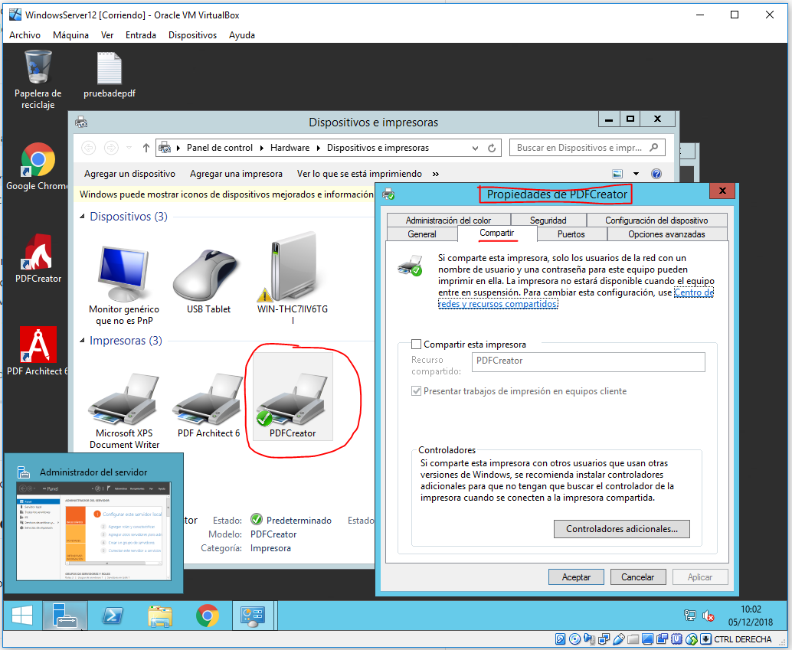

**Víctor Gabriel Carvajal Aróstegui**

**Eleazar Sánchez Arbelo**

# Servidor de Impresión en Windows.

Necesitaremos dos máquinas virtuales Windows como Windows7_cliente y Windows Server.

> Máquina cliente.

> Máquina servidor.

# 1. Impresora compartida.

## 1.1 Rol impresión.

Vamos al servidor e instalamos  la función de servidor de impresión. Ir a `Roles y características.`

## 1.2 Instalar impresora PDF.

Vamos a conectar e instalar localmente una impresora al servidor Windows Server, de modo que estén disponibles para ser accedidas por los clientes del dominio. Vamos a descargar `PDFCreator`.

> Lo instalamos y la ruta de guardado de sus archivos será por defecto.

## 1.3 Probar la impresora en local.

Creamos un documento de texto para proceder con la impresión.

> Vamos a imprimir el documento y sale de la siguiente manera.

## 1.4 Compartir por red.

Iremos a Administrador de Impresión -> Impresoras.

Elegiremos la impresora PDFCreator y la compartimos.

El siguiente paso será ponerle nombre a la impresora según la forma PDFnombrealumnoXX.

Abrimos ahora la máquina cliente, escribimos la IP del servidor y nos conectamos:

Seleccionamos la impresora y nos conectamos con usuario/clave:

Una vez realizada la conexión con éxito, probaremos si todo funciona correctamente.

Para ello hemos creado hola.txt en el cliente y lo enviamos a imprimir:

# 2. Acceso Web

Realizaremos una configuración para habilitar el acceso web a las impresoras del dominio.

## 2.1 Configurar impresión Web

Abrimos un navegador y escribimos http://ip-del-servidor/printers. Nos autenticamos para acceder al entorno que permite gestionar las impresoras.

Para terminar agregaremos una impresora <Equipo --> Agregar una impresora>.

## 2.2 Comprobar desde el navegador

Vamos a realizar una prueba sencilla para la impresora de red. Pondremos en pausa todos los trabajos de impresión y enviaremos a imprimir un documento del Bloc de notas para comprobar que el trabajo aparece en cola de impresión.

Ahora podríamos darle a reanudar para que imprima el documento.

Fin de la práctica.
