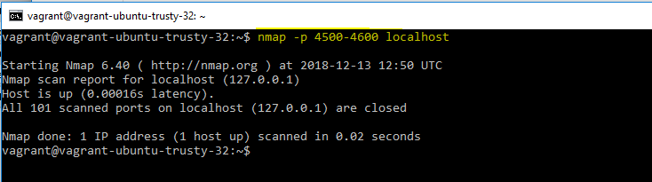
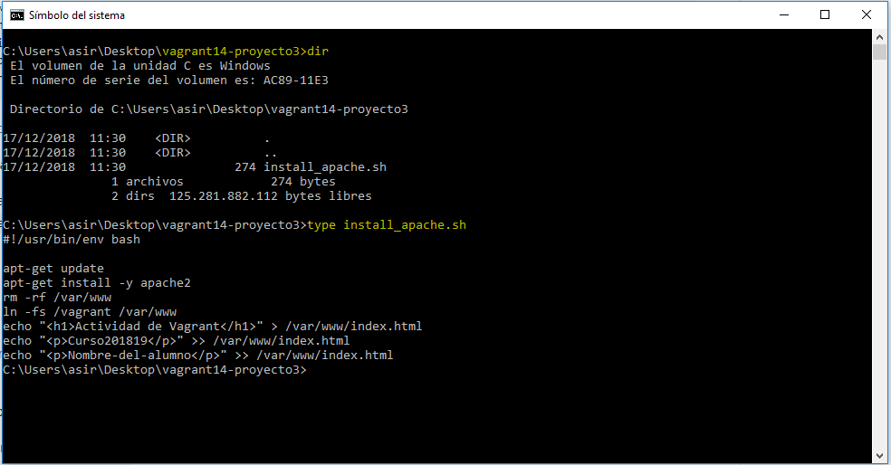
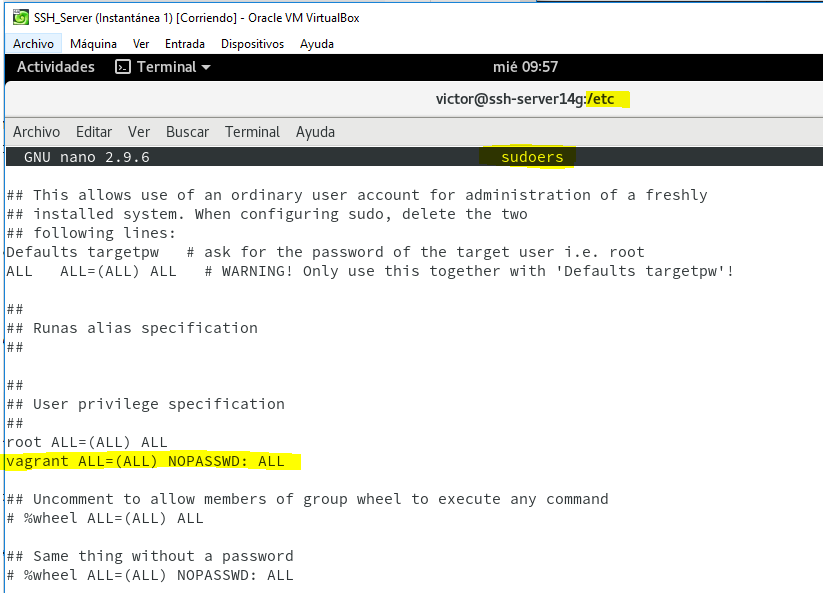

# Vagrant y VirtualBox.

# 1. Introducción.

Vagrant es una herramienta para la creación y configuración de entornos
de desarrollo virtualizados.

# 2. Primeros pasos.

## 2.1 Instalar.

Necesitamos instalar Vagrant en la máquina real. Hay varias formas de instalar Vagrant:

`apt-get install vagrant` o
usando un paquete vagrant.deb. Disponible para descargar del servidor Leela.

`vagrant version`, para comprobar la versión actual de Vagrant.

`VBoxManage -v`, para comprobar la versión actual de VirtualBox.

Si vamos a trabajar Vagrant con MV de VirtualBox, hay que comprobar que las versiones de ambos son compatibles entre sí.

## 2.2 Proyecto.

Crear un directorio para nuestro proyecto Vagrant (Donde XX es el número de cada alumno):

## 2.3 Imagen, caja o box.

Ahora necesitamos obtener una imagen de un sistema operativo. Vamos, por ejemplo, a conseguir una imagen de un `Ubuntu Precise de 32 bits`. Utilizamos `nmap -Pn host`.

> Problemas con la dirección de la práctica.

> Esta caja no sirvió para la práctica.

https://cloud-images.ubuntu.com/vagrant/trusty/20181207/

> De esta página se saca la nueva caja que vamos a usar. Vamos a usar la última.

> Hay una carpeta oculta donde se guardan las cajas.

Para usar una caja determinada en nuestro proyecto, modificamos el fichero `Vagrantfile` (dentro de la carpeta de nuestro proyecto).
Cambiamos la línea `config.vm.box = "base"` por `config.vm.box = "micajaXX_ubuntu_precise32"`.
Es más cómodo trabajar con el fichero si eliminamos todas las líneas de comentarios. De modo que vamos a hacer una copia de seguridad del archivo `Vagrantfile` a `Vagrantfile.bak`, y vamos a quitar todas las líneas comentadas del `Vagrantfile`.

## 2.4 Iniciar una nueva máquina.

> Comando para conectar por SSH con nuestra máquina Vagrant.

A continuación otros comandos útiles.

`vagrant suspend`: Suspender la máquina virtual. Tener en cuenta que la MV en modo suspendido consume más espacio en disco debido a que el estado de la máquina virtual que suele almacenarse en la RAM se pasa a disco.

`vagrant resume` : Volver a despertar la máquina virtual.

`vagrant halt`: Apagarla la máquina virtual.

`vagrant status`: Estado actual de la máquina virtual.

`vagrant destroy`: Para eliminar la máquina virtual (No los ficheros de configuración).

# 3. Configuración del entorno virtual.

## 3.1 Carpetas sincronizadas.

Esto nos mostrará que efectivamente el directorio `/vagrant` dentro del entorno virtual posee el mismo `Vagrantfile` que se encuentra en nuestro sistema anfitrión.

## 3.2 Redireccionamiento de los puertos.

Cuando trabajamos con máquinas virtuales, es frecuente usarlas para proyectos enfocados a la web, y para acceder a las páginas es necesario configurar el enrutamiento de puertos.

> En la imagen vemos que necesitamos el usuario sudo para poder hacer update.

Modificar el fichero Vagrantfile, de modo que el puerto 4567 del sistema anfitrión sea enrutado al puerto 80 del ambiente virtualizado.

Volvemos a iniciar la MV con `vagrant reload`. Es posible que nos salga un mensaje de precaución del firewall.

Confirmar que hay un servicio a la escucha en 4567. Para ello, `vagrant ssh` y, en la MV, ejecutamos nmap.

> Vemos que, iniciando en la máquina real una búsqueda en el navegador, tenemos acceso y todo va bien.

# 4. Ejemplos de configuración Vagrantfile.

`config.vm.network "private_network", ip: "192.168.33.10"`

Ejemplo para configurar las carpetas compartidas:
`config.vm.synced_folder "htdocs", "/var/www/html"`

Ejemplo para configurar la conexión SSH de vagrant a nuestra máquina virtual:

`config.ssh.username = 'root'`

`config.ssh.password = 'vagrant'`

`config.ssh.insert_key = 'true'`

Ejemplo para configurar la ejecución remota de aplicaciones gráficas instaladas en la máquina virtual, mediante SSH:

`config.ssh.forward_agent = true`

`config.ssh.forward_x11 = true`

# 6. Suministro.

Ejecutar una serie de scripts durante el proceso de arranque del entorno virtual para instalar, configurar y personalizar un sin fin de aspectos del SO del sistema anfitrión.

## 6.1 Proyecto 3 (Suministro mediante shell script).

Vamos a indicar a Vagrant que debe ejecutar el script anterior.

> Tener cuidado de copiar las líneas correspondientes dentro del Vagrantfile del nuevo proyecto. Crear el archivo Vagrantfile si fuera necesario y `vagrant init`, `vagrant up`.

> En la siguiente imagen de arriba podemos comprobar que podemos tener un error a la hora de que el Apache no aparezca debido a un problema con las direcciones del index.html porque es una versión antigua.

Observamos que vamos al navegador y la dirección con puerto 4567 nos muestra Apache corriendo.

## 6.2 Proyecto 4 (Suministro mediante Puppet).

Personalizamos el Vagrantfile.

Creamos la ruta `manifests/default.pp` e insertamos la información siguiente.

Para que se apliquen los cambios de configuración debemos, con la MV encendida, recargar la configuración `vagrant reload`, y volver a ejecutar la provisión `vagrant provision`.

# 7. Proyecto 5 (Nuestra caja)

En este apartado vamos a crear nuestra propia caja/box personalizada a partir de una MV de VirtualBox que tengamos.

## 7.1 Preparar la MV VirtualBox.

Crear una MV VirtualBox nueva o usar una que ya tengamos e instalar OpenSSH Server en la MV. A continuación, crear el usuario `vagrant`, para poder acceder a la máquina virtual por SSH. A este usuario le agregamos una clave pública para autorizar el acceso sin clave desde Vagrant.

Lo que estamos haciendo es crear una llave pública para poder conectar con la otra máquina a partir de dicha llave.

 Poner clave `vagrant` al usuario vagrant y al usuario root.

 

Tenemos que conceder permisos al usuario `vagrant` para que pueda configurar la red, instalar software, montar carpetas compartidas, etc. para ello debemos configurar `/etc/sudoers` para que no nos solicite el password de root, cuando realicemos estas operación con el usuario vagrant.

Debemos asegurarnos que tenemos instalado las VirtualBox Guest Additions con una versión compatible con el host anfitrión.

## 7.2 Crear caja Vagrant.

Con el siguiente comando comprobamos las máquinas virtuales que existen en nuestro ordenador.

Con los siguientes comandos se crea la caja que vamos a exportar y la visualizamos en nuestro ordenador.

