# Clientes Ligeros con LTSP/Ubuntu

## 2. Preparativos

Se usarán dos máquinas virtuales para montar clientes ligeros con LTSP.

## 3. Servidor LTSP

### 3.1 Preparar la MV Server

La máquina servidor tendrá dos interfaces de red.

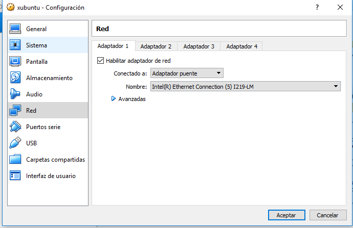

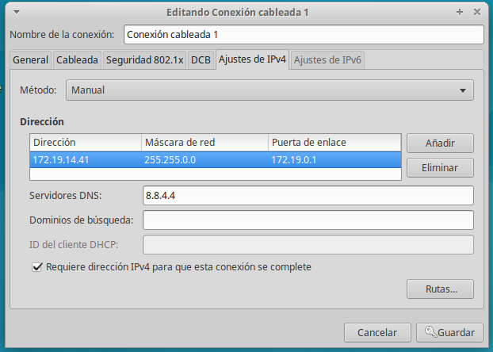

> La primera interfaz será la externa y servirá para comunicarse con Internet.

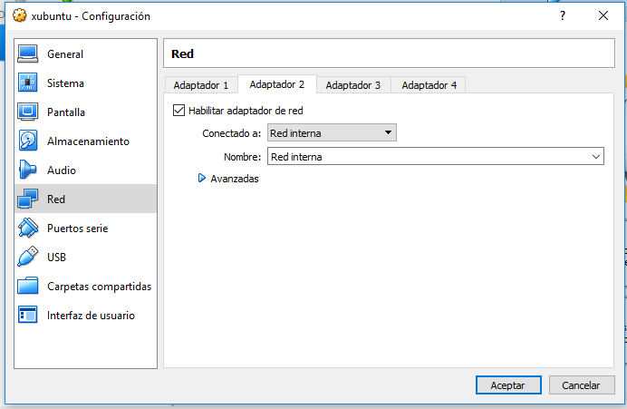

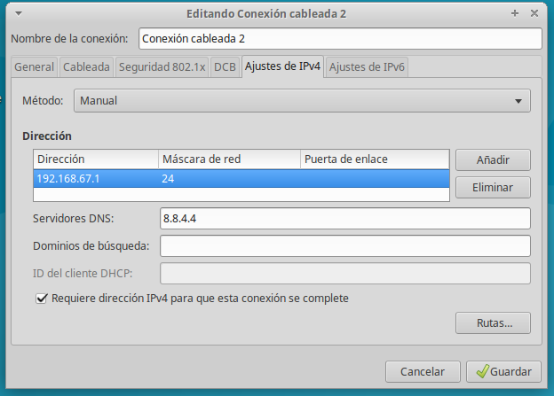

> La segunda interfaz servirá para conectarse con los clientes ligeros. Esta
interfaz debe ser estática y debe estar en la misma red que los clientes.

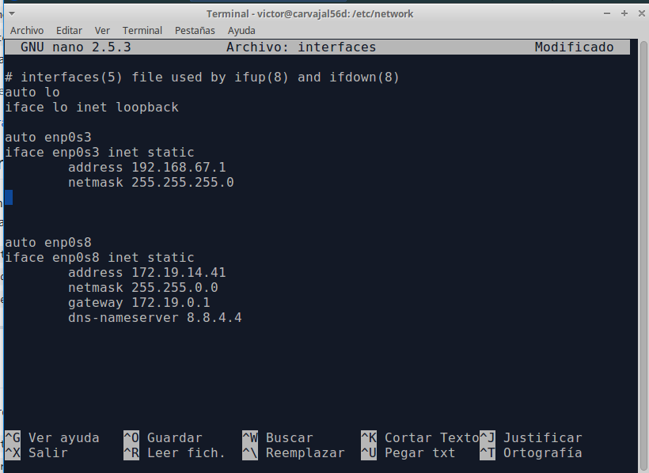

> Si la configuración de antes diera problemas entonces vamos a cambiarla
con la consola yendo a estas direcciones.

### 3.2 Instalación del SSOO

Una vez instalado nuestro sistema operativo, que será Xubuntu, debemos hacer
unas comprobaciones iniciales.

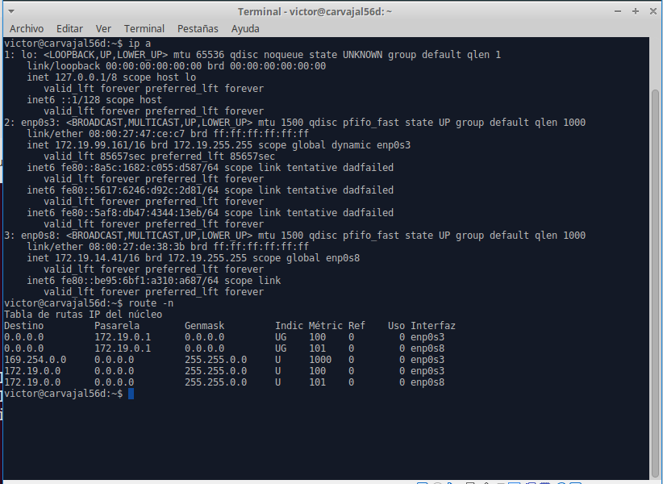

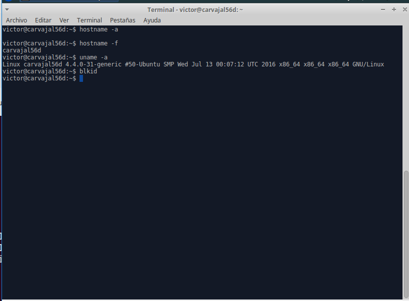

A continuación, creamos tres usuarios locales.

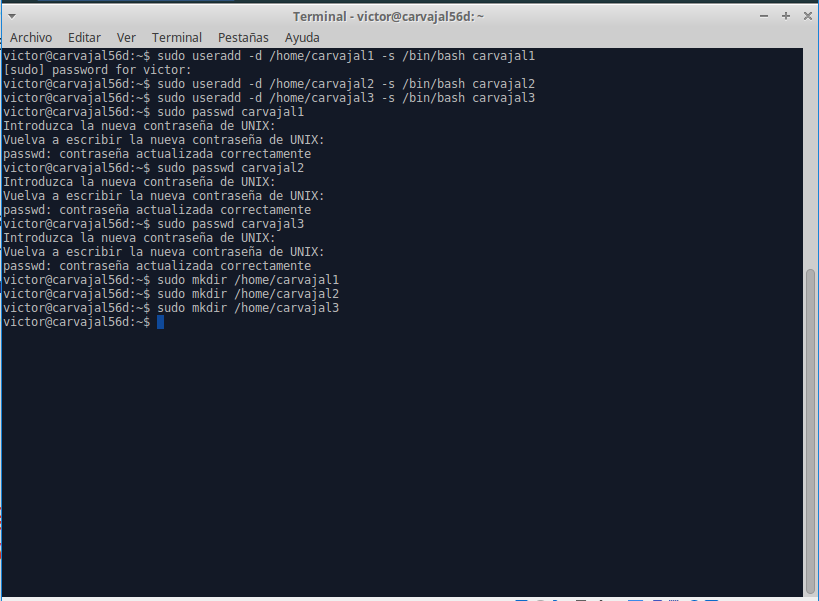

### 3.3 Instalar el servicio SSH

Ahora instalamos el servicio SSH a partir de la terminal.

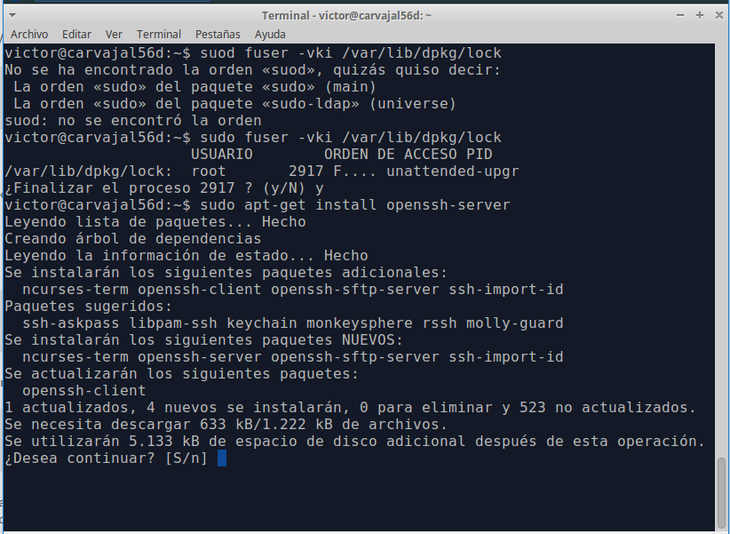

> En la imagen vemos unos comandos no conocidos. Es una manera encontrada de
solucionar un error que nos impide instalar nuevos archivos.

Ahora debemos cambiar una línea en nuestra instalación.

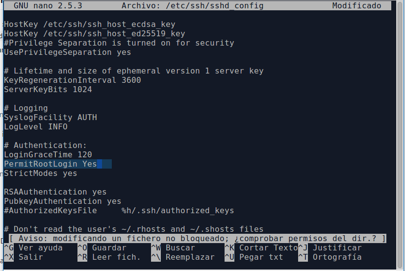

> La dirección a la que debemos ir para cambiar la línea que nos interesa
está en la parte de arriba de la imagen.

### 3.4 Instalar el servicio LTSP

Instalamos el servidor de clientes ligeros.

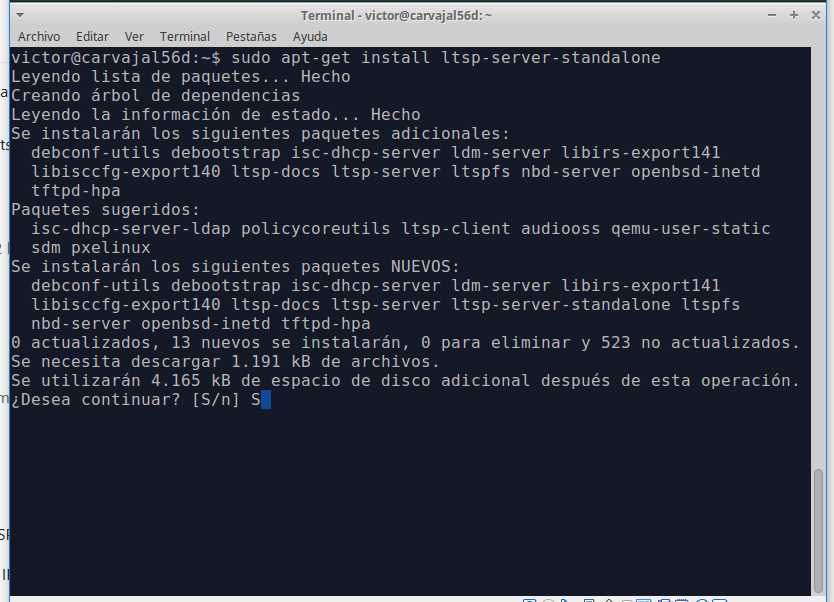

Con la siguiente foto hemos creado una imagen de 32 bits del SO. Esto se
cargará en la memoria interna de los clientes ligeros.

Con el siguiente comando consultamos información de lo que hemos hecho.

Después de todo esto, consultamos el fichero de configuración del servicio
DHCP instalado junto con LTSP.

Comprobar si las rutas son correctas:
