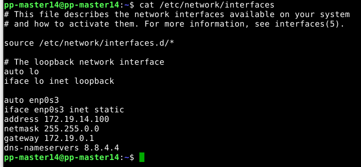
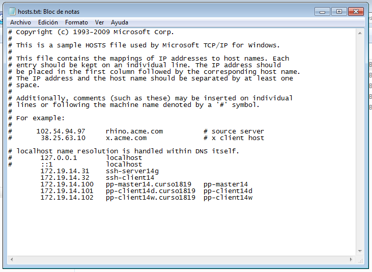
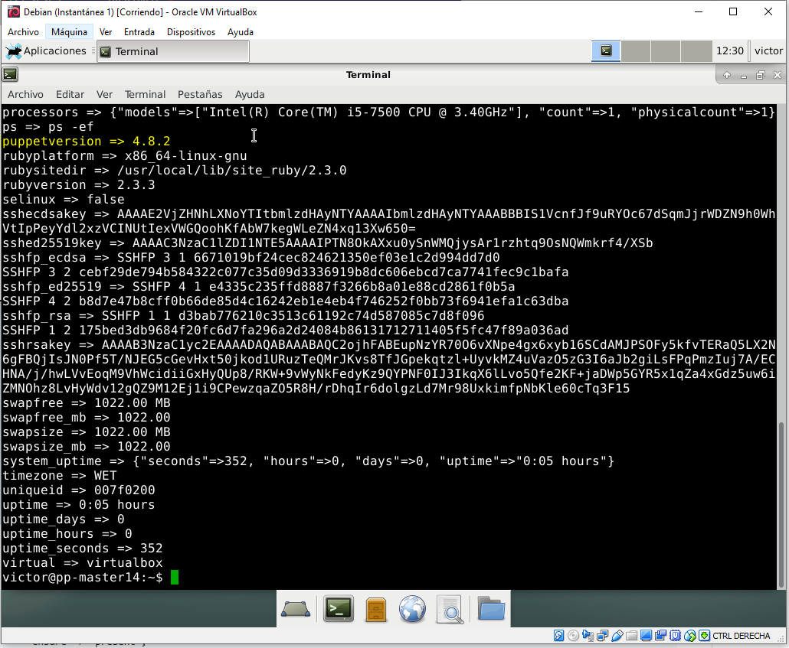
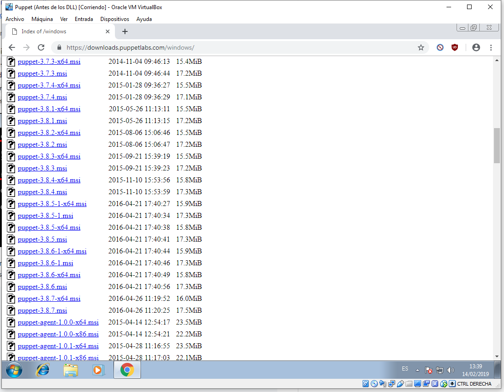
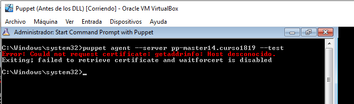
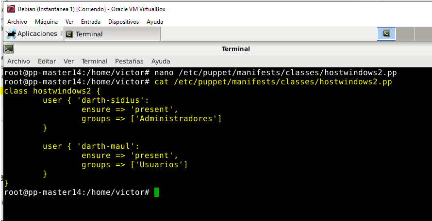
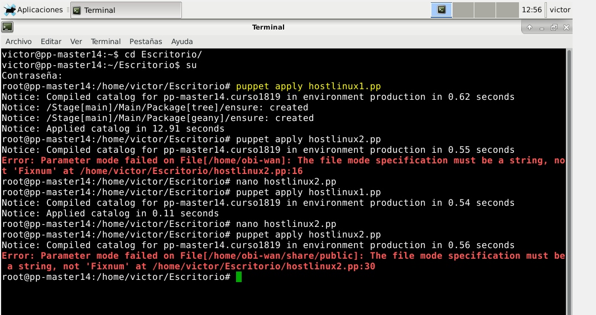
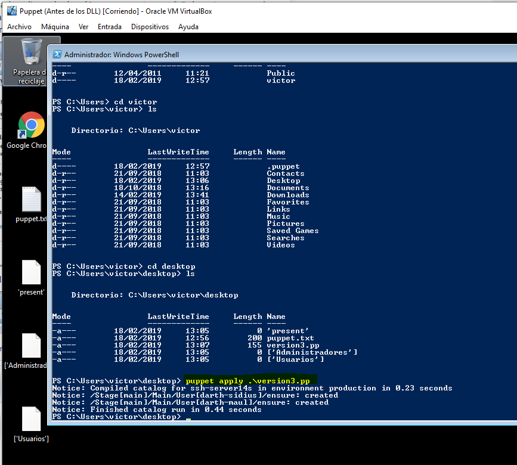

# PUPPET

# 1. Introducción.

Es una herramienta diseñada para administrar la configuración de sistemas Windows de forma declarativa. El usuario describe los recursos del sistema y sus estados, ya sea un declarativo de Puppet o un DSL (lenguaje específico del dominio) de Ruby.

## 1.1 Requisitos.

## 1.2 Servidor DNS y el fichero /etc/resolv.conf.

## 1.3 Hostname y dnsdomainname.

## 1.4 Resolución de nombres.

Comandos a usar:

* `synaptic&` para entrar en paquetes para desinstalar.

* Desinstalar `Networkmanager`

* Volver a escribir en `/etc/resolv.conf -> nameserver 8.8.4.4` y reiniciar la máquina.

# 2. Instalación y configuración del MASTER.

## 2.1 Configurar servidor DNS.

Comprobaciones.

**Cómo deberia quedar para tener conexión.**

# 4. Fichero pp VERSION-1.

> `/var/log/syslog` para observar los fallos por si hubiera.

# 5. Instalación y configuración del cliente puppet Debian.

## 5.1 Preparativos para CLIENT1.

## 4.2 Instalación del agente.

> Hay que incluir esa línea en esa dirección en el cliente.

# 6. Aceptar certificado.

Antes de que el master acepte a `pp-client14d.curso1819`, como cliente, se deben intercambiar los certificados.

## 6.1 Aceptar certificado.

## 6.2 Comprobación.

Vamos a comprobar que las órdenes (manifiesto) del master, llega
bien al cliente y éste las ejecuta.

> Iniciamos el servicio Puppet y, si tuviéramos fallos, consultar los dos comandos siguientes.

# 7. Fichero pp VERSION-2.

Primero hemos probado una configuración sencilla en PuppetMaster. Ahora podemos pasar a algo más complejo en este apartado.

Contenido para `hostlinux2.pp`, versión 2 en `/etc/puppet/manifests/classes/`:

Modificar `site.pp` con:

# 8. Fichero pp VERSION-3: Cliente puppet windows.

En el master vamos a crear una configuración puppet para las máquinas windows, dentro del fichero `/etc/puppet/manifests/classes/hostwindows3.pp`, con el siguiente contenido:

Ahora vamos a modificar el fichero `site.pp` del master, para que tenga en cuenta la configuración de clientes GNU/Linux y clientes Windows, de la siguiente forma:

Entramos a Windows.

Modificar el fichero de la misma forma que hicimos para client1.

Ir al master y ejecutar el comando `facter`, para ver la versión de Puppet que está usando el master.

Ahora vamos a instalar `puppet` en Windows. En https://downloads.puppetlabs.com/windows/

> Descargamos la versión 3.8.2 pero no es la que debemos utilizar.

Iniciar consola `puppet` como administrador.

> Este es el principal problema de esta práctica; no coinciden las versiones de Puppet de Linux y las de Windows.

Con los comandos anteriores podemos hacernos una idea de como terminar de configurar el fichero `/etc/puppet/manifests/classes/hostwindows2.pp` del master.

# Demostración.

