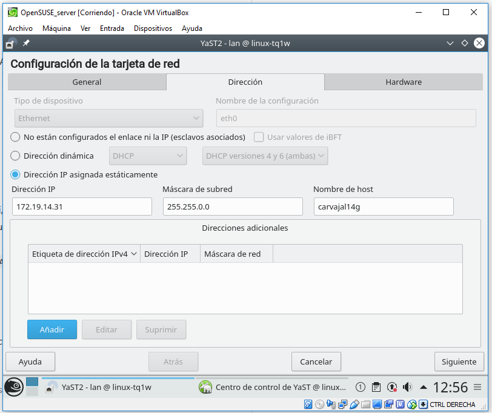

# Práctica de VNC.

## 1. Introducción.

## 2. Conexiones remotas con VNC.

Vamos a proceder a instalar, a través de máquinas virtuales, a observar el comportamiento de herramientas VNC.

## 3. Instalación en Windows.

Necesitaremos dos máquinas virtuales Windows 7 para empezar.

Ahora debemos configurar las máquinas virtuales.

Una vez configuradas las máquinas ahora descargamos un programa llamado **TightVNC** en la máquina cliente.

> "Complete"

> Elegimos las contraseñas de acceso desde el cliente.

### 3.1 Ir al servidor VNC en Windows.

En el cliente vamos a instalar el **TightVNC server** y tendremos que tener precaución con la configuración del cortafuegos para aceptar el VNC.

###	 3.2 Ir a la máquina real en Linux.

Poner en la consola **nmap -Pn IP-VNC-SERVER** para comprobar que los servicios son visibles desde fuera de la máquina VNC-SERVER. Deben verse los puertos 5801, 5901, etc.

### 3.3 Ir al cliente.

### 3.4 Comprobaciones finales.

## 4. Instalación en OpenSUSE.

Configurar las máquinas virtuales servidor y cliente.

#### 4.1 Ir al servicio VNC OpenSUSE.

**Yast -> VNC**
