# VNC

# 1. Instalación en Windows.

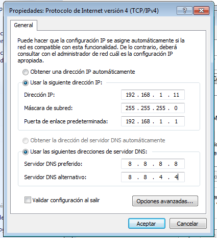

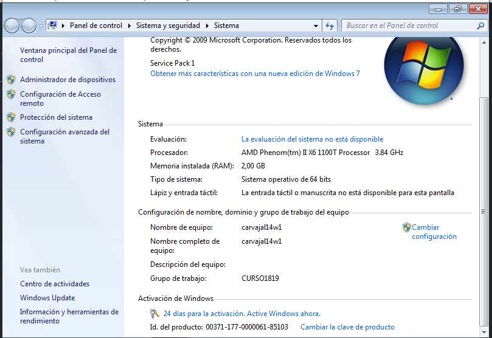

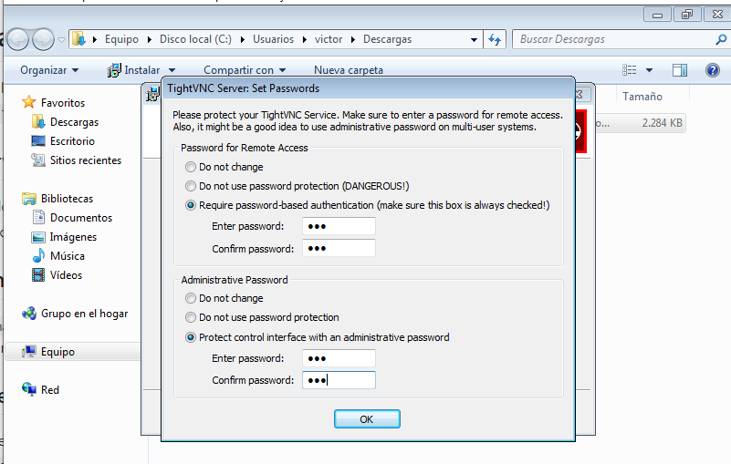

## 1.1 Ir al servidor VNC en Windows.

Establecemos reglas en el firewall para permitir la conexión.

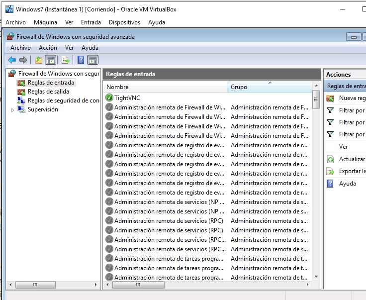

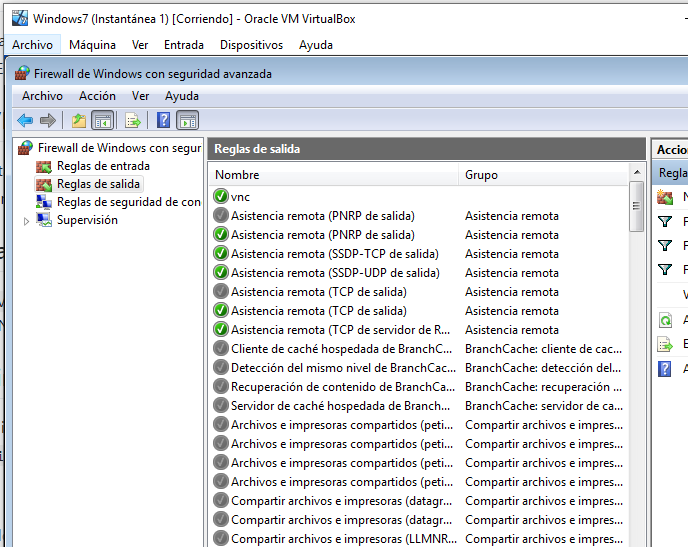

## 1.2 Ir a la máquina GNU/Linux.

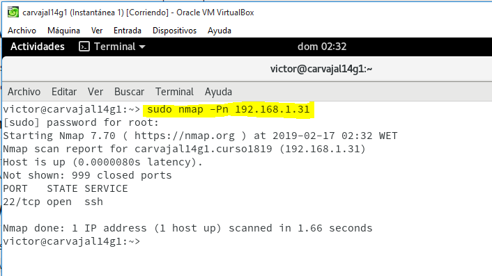

## 1.3 Ir al cliente Windows.

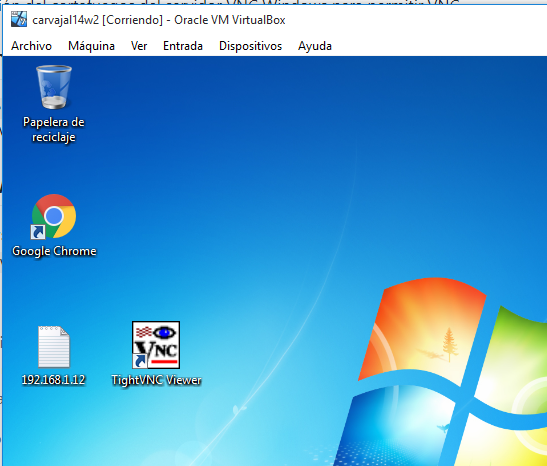

## 1.4 Comprobaciones finales.

# 2. Instalación en OpenSUSE.

## 2.1 Ir al servidor VNC OpenSUSE.

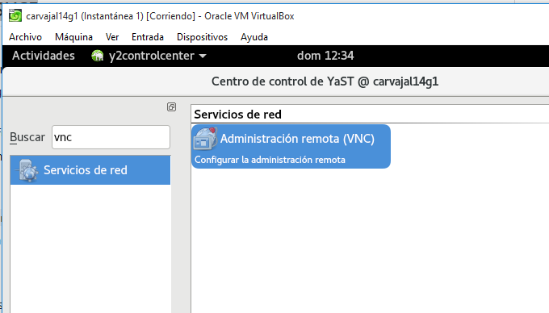

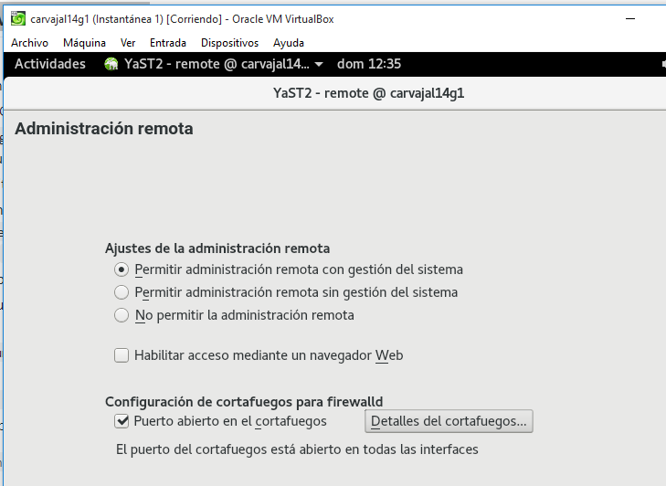

> Se instalará un paquete adicional.

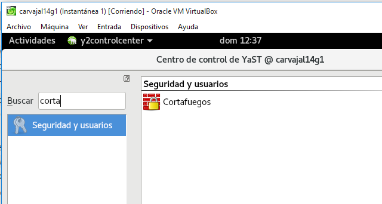

> se instalará otro paquete adicional.

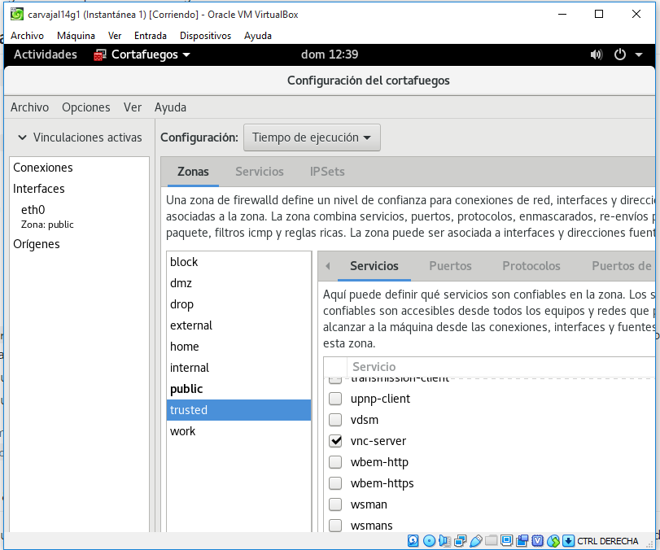

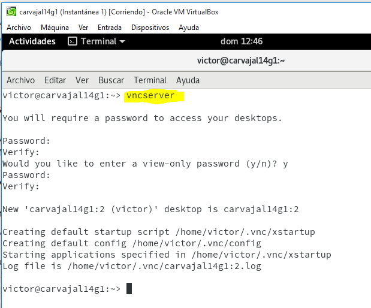

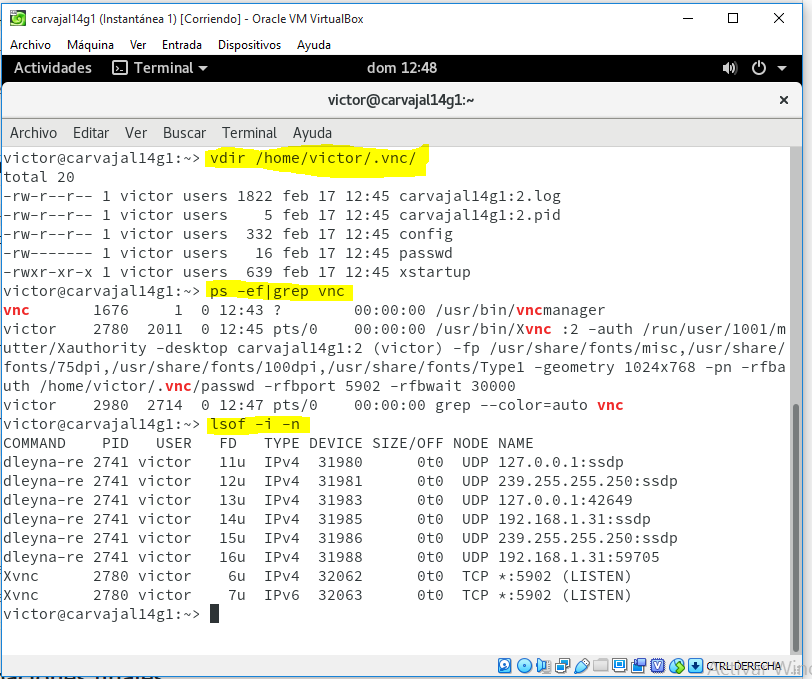

## 2.2 Ir a la máquina GNU/Linux.

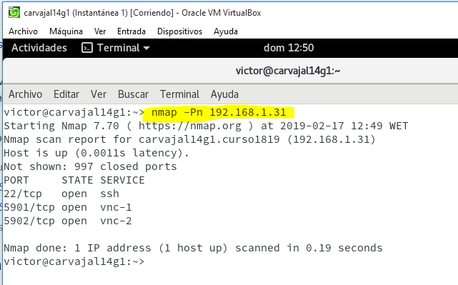

## 2.3 Ir al cliente GNU/Linux.

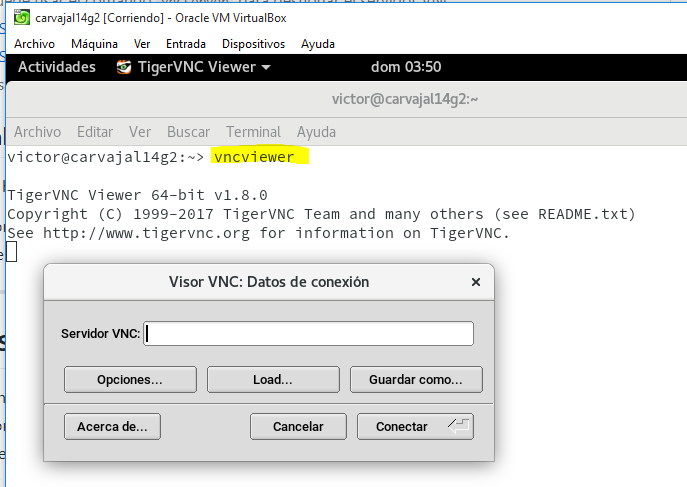

## 2.4 Comprobaciones finales.

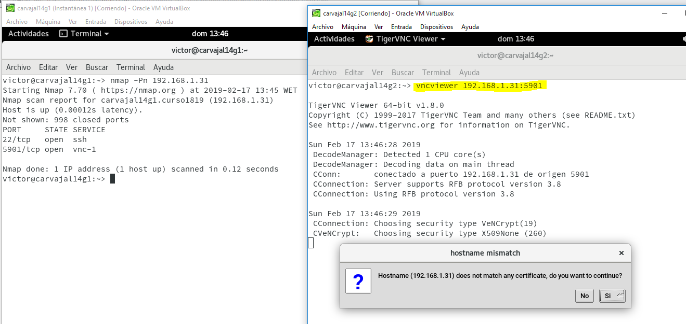

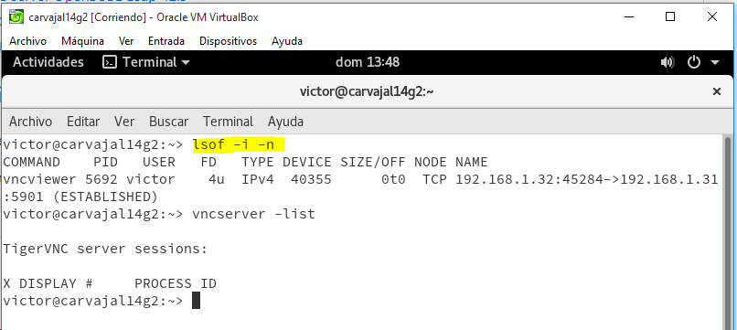

# 3. Comprobaciones con SSOO cruzados.

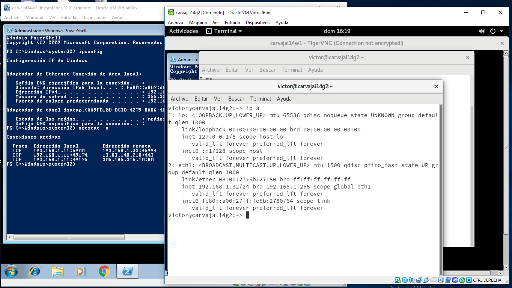

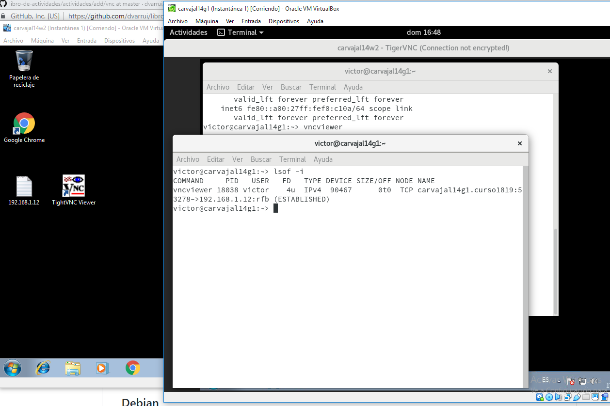

# 4. DISPLAY 0 en GNU/Linux.
